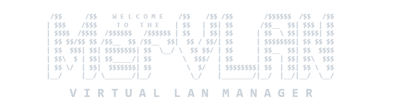

<p align="center">
  
</p>

#

MerVLAN is an addon for Asuswrt‑Merlin that adds a **graphical VLAN manager directly inside the stock Asus/Merlin web UI**.

It is designed for AP‑mode deployments and lets you:

- Assign VLANs per SSID (Wi‑Fi network)
- Assign VLANs per physical LAN port
- (Experimental) Configure trunk ports for nodes connected directly to the main unit
- Synchronize VLAN config to other Asuswrt‑Merlin nodes over SSH

The addon installs under the normal Merlin web interface (LAN section) and handles the low‑level bridge/VLAN wiring for you.

> [!WARNING]
> **MerVLAN is not a router or managed switch.** It tags and bridges traffic at the AP; you still need a VLAN-aware upstream switch/firewall for routing, DHCP, and policy.

> [!TIP]
> New here or looking for setup details? Read the full [MerVLAN Help Guide](docs/HELP.md) for topology examples, requirements, supported devices, troubleshooting, and mapper instructions.  
> The full help guide is also available offline from within the MerVLAN UI. Click **INFO** → **Help**.

---

<a id="index"></a>

## Index

1. [Status / Beta Notes](#status-beta-notes)
2. [What MerVLAN Actually Does](#what-mervlan-actually-does)
3. [Key Features](#key-features)
4. [Requirements](#requirements)
5. [Limitations](#limitations)
6. [Install](#install)
7. [Uninstall](#uninstall)
8. [Update and Restore](#update)
9. [Logs & Debugging](#logs-debugging)
10. [Development / Testing Notes](#development-testing-notes)
11. [Changelog](#changelog)
12. [Help wanted: LAN/ETH port mapping (device support)](#help-wanted)
13. [Branches, Releases and Contributions](#branches-releases-and-contributions)
14. [Community Contributors](#community-contributors)
15. [License](#license)

---

<h2 id="status-beta-notes">Status / Beta Notes <sub><sup><a href="#index">. . . [back to index]</a></sup></sub></h2>

- **[View the complete list of supported devices](docs/HELP.md#10-device-support)**
- **Status:** Public beta – expect bugs and breaking changes.
- **Mode:** **AP‑mode only** (main and nodes must be running as APs, not routers).
- For setup questions and general discussion, use [Discord](https://discord.com/invite/8c3C8q54hn) or [snbforums.com](https://www.snbforums.com/threads/mervlan-v0-52-1-dev-0-52-7-simple-and-powerful-vlan-management-beta.95936/).
- For reproducible bugs or broken features, open a [GitHub Issue](https://github.com/r80xcore/mervlan/issues) and include the relevant information from <kbd>INFO</kbd> → <kbd>View Logs</kbd>.

---

<h2 id="what-mervlan-actually-does">What MerVLAN Actually Does <sub><sup><a href="#index">. . . [back to index]</a></sup></sub></h2>

Out of the box, Asuswrt-Merlin in AP mode treats all physical LAN ports and wireless radios as one flat broadcast domain, placing everything into a single shared Linux bridge (`br0`). MerVLAN transforms supported Asus routers into VLAN-aware access points by managing Linux kernel bridges, 802.1Q tagged interfaces, and Layer 2 isolation directly from the web UI, without requiring manual configuration of shell scripts.

### How It Works

* **Kernel-Level Bridge Isolation**  
  When you assign a VLAN ID to a Guest SSID or physical LAN port, MerVLAN creates a dedicated Linux bridge for that VLAN (e.g. `br20`), moves the corresponding wireless virtual interfaces (`wl0.1`, `wl1.1`) and Ethernet ports out of `br0`, and binds them to the new bridge. Strict `ebtables` filtering and MAC Shield protection prevent VLAN devices from escaping across bridges or acquiring an unauthorized DHCP lease on the default LAN, while metadata override rules allow trusted management/admin devices to traverse freely.

* **802.1Q Uplink Trunking & WAN Native**  
  MerVLAN attaches each VLAN bridge to an 802.1Q tagged sub-interface on the uplink port (such as `eth0.20`), seamlessly trunking client traffic over your Ethernet backhaul to your upstream managed switch or router/firewall (like OPNsense, pfSense, UniFi, or MikroTik). You can also wrap the AP's own `br0` management interface onto a tagged **WAN Native VLAN** to isolate router administration onto its own network.
  A WAN Native VID is reserved on that device: do not reuse it for a managed SSID, LAN access port, or trunk. AiMesh nodes follow MAIN's effective native mode and each need their own DHCP reservation when it is tagged; standalone APs retain an independent mode.

* **Multi-Node Sync & Event-Driven Auto-Healing**  
  In multi-AP setups (AiMesh or standalone APs), the main router acts as a coordinator, pushing device-specific configurations across all nodes over SSH. Because Asus firmware routinely restarts interfaces during Wi-Fi events or DHCP renewals, MerVLAN hooks into Merlin's service-event system and runs a background health monitor to automatically repair bridges, re-bind interfaces, and ensure settings persist across reboots.

> [!NOTE]
> MerVLAN operates strictly at **Layer 2 (bridging and tagging)** on the access point. IP routing, DHCP server assignments, and inter-VLAN firewall rules remain entirely the responsibility of your upstream gateway.

---

<h2 id="key-features">Key Features <sub><sup><a href="#index">. . . [back to index]</a></sup></sub></h2>

- **[SSID Configuration](docs/HELP.md#2-ssid-configuration)** – Map wireless guest networks to dedicated VLAN IDs with optional AP isolation.
- **[LAN Port Configuration](docs/HELP.md#3-lan-port-configuration)** – Assign individual physical ports to VLANs or configure trunk ports for connected devices.
- **[WAN Native VLAN](docs/HELP.md#4-wan-native-vlan)** – Encapsulate router and node management (`br0`) onto a tagged uplink VLAN.
- **[Apply Modes & Multi-Node](docs/HELP.md#5-applying-your-configuration)** – Apply to local router only, nodes only, or synchronized router + nodes over SSH.
- **[SSH Key Management](docs/HELP.md#6-ssh-key-install)** – Automated ED25519 key generation and guided setup for AiMesh and standalone APs.
- **[Active Clients & MAC Shield](docs/HELP.md#7-logs--monitoring)** – Real-time VLAN client inventory, MAC Shield isolation controls, and live command/runtime logs.
- **[Settings & Dry Run](docs/HELP.md#settings-modal)** – Safe configuration simulation with Dry Run mode, STP, Pause Event Reactions, and Native SSID (ENS) controls.
- **[Boot Persistence & Auto-Heal](docs/HELP.md#5-applying-your-configuration)** – Automatic configuration re-apply on boot with continuous 5-minute health monitoring.
- **[Update, Backup & Restore](docs/HELP.md#8-updating-or-restoring-mervlan)** – One-click updates across release channels, automatic pre-update backups, point-in-time restore, and undo tools.

---

<h2 id="requirements">Requirements <sub><sup><a href="#index">. . . [back to index]</a></sup></sub></h2>

- **Asuswrt‑Merlin firmware** with addon support on every device that will tag VLANs.
- **AP‑mode only** on all participating routers/APs.
- **JFFS enabled** for persistent storage.
- **SSH enabled** on the main AP and nodes. AiMesh nodes receive authorized keys through the firmware after reboot.
- **Ethernet backhaul** between the main unit, upstream switch, and nodes. Wi-Fi backhaul cannot preserve the required VLAN tags.
- **VLAN-aware upstream network** for routing, DHCP, and firewall policy.

Multi‑AP notes:

- Each node must either connect to a VLAN-aware switch or directly to a trunk-enabled LAN port on the main unit using the experimental MAIN → NODE topology.
- LAN-port VLAN assignments can be configured separately for the main AP and each node.
- AiMesh and standalone APs use different SSH-key setup steps. See [SSH Key Install](docs/HELP.md#6-ssh-key-install).

See [Getting Started](docs/HELP.md#1-getting-started-with-mervlan) for supported topology details.

---

<h2 id="limitations">Limitations <sub><sup><a href="#index">. . . [back to index]</a></sup></sub></h2>

- Wireless VLAN assignments are limited by the usable SSID slots supported by each device. Wired-only VLANs can also be assigned to available LAN ports.
- Mesh behavior is constrained by Asus firmware:
  - Some models support more guest SSIDs than they can actually mesh; non‑mesh SSIDs will only broadcast from the main node.
  - Devices on VLANs use standard band steering; per‑VLAN steering is not supported.
- Experimental MAIN → NODE trunking supports one direct hop. NODE → NODE trunking is not supported.

---

<h2 id="install">Install <sub><sup><a href="#index">. . . [back to index]</a></sup></sub></h2>

Only install if you are comfortable with **beta software** and have a way to recover (including factory reset) if something goes wrong.

Before installing, skim the [MerVLAN Help Guide](docs/HELP.md), especially the topology and requirements sections.

SSH into the AP and run this command. The addon will be placed under **LAN → MerVLAN** in the GUI:

```sh
mkdir -p /jffs/addons/mervlan && /usr/sbin/curl -fsL --retry 3 "https://raw.githubusercontent.com/r80xcore/mervlan/refs/heads/main/install.sh" -o "/jffs/addons/mervlan/install.sh" && chmod 0755 /jffs/addons/mervlan/install.sh && /jffs/addons/mervlan/install.sh full
```

Need an offline or locally staged installation archive instead? Follow the
[local-tarball installation flow](docs/HELP.md#install-from-a-local-tarball).
For an already-installed addon, use the separate
[local-tarball update flow](docs/HELP.md#update-from-a-local-tarball), not the
installer.

The guided installer lets you:

- Choose the latest stable release or the development branch.
- Review the SSH username and port used for nodes.
- Preserve an existing MerVLAN configuration or perform a clean installation.

For a directed pre-release test, replace `main` in the bootstrap URL with the
requested branch, then select **Custom branch** and enter that same branch in
the installer. In a Raw GitHub URL use the branch name directly, not
`refs/heads/<branch>`. See the Help Guide for the separate offline archive
sequence.

For installer test mode and other manual installation options, see [Install, Reinstall, and Uninstall Commands](docs/HELP.md#install-reinstall-and-uninstall-commands).

### Development install

Select **Development branch** in the installer. It may include newer fixes and features that are not yet available in a stable release, but changes may be less tested, reworked, or removed before release.

Development and test branches also contain the `dev-tools/` workspace. It
holds local tests, router-capable test drivers, safety helpers, evidence, and
development notes. Development `Sync Nodes` copies only the executable
router-capable tools to configured nodes; the production `main` branch does
not include this workspace.

If the web UI looks out of sync after manual file changes, use the log-preserving refresh described under [Install, Reinstall, and Uninstall Commands](docs/HELP.md#install-reinstall-and-uninstall-commands). Do not use a normal uninstall and install as a UI refresh because it can change service state.

---

<h2 id="uninstall">Uninstall <sub><sup><a href="#index">. . . [back to index]</a></sup></sub></h2>

Standard uninstall removes the web UI and service hooks while preserving MerVLAN files and stored data. Full uninstall removes the complete addon and its settings, then explicitly asks whether retained update/manual backups should be deleted too.

| Command | What it does |
| --- | --- |
| `sh uninstall.sh full` | Fully uninstall MerVLAN after confirmation, with a separate backup-deletion choice. |
| `sh uninstall.sh full --yes --delete-backups` | Fully uninstall MerVLAN non-interactively, including retained backups, for a controlled automation run. |

> [!CAUTION]
> Choosing backup deletion permanently removes every saved MerVLAN backup.

For standard uninstall and UI refresh commands, see [Install, Reinstall, and Uninstall Commands](docs/HELP.md#install-reinstall-and-uninstall-commands).

---

<h2 id="update">Update and Restore <sub><sup><a href="#index">. . . [back to index]</a></sup></sub></h2>

MerVLAN includes built-in update, backup, restore, and temporary undo tools. Open them by clicking the version button in the bottom-right corner of the web UI.

### Update

The **Update** tab can install a tagged release, the current `main` or `dev` version, or a custom test branch. It compares the selected version with your current installation, warns before a downgrade, and shows the changelog when one is available.

By default, an update keeps your settings, SSH keys, MAC Shield data, backups, and existing logs. You can choose to clear older logs before starting. An automatic backup is created before the installed version is replaced, and reachable configured nodes are updated with the main unit.

For an offline recovery or test package, the same transaction also accepts
`sh functions/update_mervlan.sh local /absolute/path/archive.tar.gz`. The
archive must be a non-symlink regular file and is checked for unsafe paths,
multiple roots, and links before MerVLAN extracts it. The original file is not
changed. See the Help Guide for the full safety requirements.

### Backup and Restore

The **Restore** tab keeps the three newest automatic update backups and up to three named manual backups. You can create, restore, or delete backups directly from the web UI.

A restore returns the complete MerVLAN installation—including its version, settings, and stored data—to the selected backup. MerVLAN validates the backup first and keeps the current installation available for automatic recovery if the restored version cannot be activated successfully.

After a successful update or restore, a temporary **Undo Update** or **Undo Restore** option may be available until the next reboot.

For step-by-step instructions, see [Updating or Restoring MerVLAN](docs/HELP.md#8-updating-or-restoring-mervlan). For manual commands, see [Update, Backup, and Restore Commands](docs/HELP.md#update-backup-and-restore-commands). The same Help Guide is available from <kbd>INFO</kbd> &rarr; <kbd>Help</kbd> in the MerVLAN UI.

---

<h2 id="logs-debugging">Logs & Debugging <sub><sup><a href="#index">. . . [back to index]</a></sup></sub></h2>

Open <kbd>INFO</kbd> for live command output, then select <kbd>View Logs</kbd> for the VLAN Manager, CLI Output, and Boot & Startup logs. Runtime logs are stored under `/tmp/mervlan_tmp/logs` and are cleared on reboot.

See [Logs & Monitoring](docs/HELP.md#7-logs--monitoring) for common problems and the [CLI log commands](docs/HELP.md#logs-and-quick-debugging) when working manually over SSH.

---

<h2 id="development-testing-notes">Development / Testing Notes <sub><sup><a href="#index">. . . [back to index]</a></sup></sub></h2>

MerVLAN is beta software developed primarily on ASUS AP-mode systems. Hardware and firmware behavior varies, so development builds and experimental trunk features need broader testing.

See [Branches, Releases and Contributions](#branches-releases-and-contributions) for development channels and [Get Help & Support](docs/HELP.md#11-get-help--support) for testing and discussion links. Developers working from `dev` should start with `dev-tools/README.md`.

---

<h2 id="changelog">Changelog <sub><sup><a href="#index">. . . [back to index]</a></sup></sub></h2>

See the **[`changelog.txt`](changelog.txt)** in this repository for detailed version history and notes.

---

<h2 id="help-wanted">Help wanted: LAN/ETH port mapping (device support) <sub><sup><a href="#index">. . . [back to index]</a></sup></sub></h2>

Accurate LAN-to-interface mappings are required to add official support for new routers. If your router runs Asuswrt-Merlin and is not yet in our supported device list, we would love your help mapping its ports! MerVLAN already supports 25+ models, and an interactive mapper script is available to guide you through the test, generate a report, and prepare a GitHub issue automatically.
See [Device Support and mapper instructions](docs/HELP.md#10-device-support) for the full supported-device table and step-by-step procedure.

### Models requiring testing
> [!TIP]
> This list is continuously updated, but unlisted older or newly released models running Asuswrt-Merlin are always welcome for testing!

**Wi-Fi 7 / BE series:**

- RT-BE58 Go
- RT-BE96U
- GT-BE98 Pro *(Note: base GT-BE98 is supported, but GT-BE98 Pro has a different port layout and is unverified)*
- GT-BE19000AI

**ROG & high-performance series:**
- GT-AXE11000 *(Note: GT-AX11000, GT-AX11000 Pro, and GT-AXE16000 are supported)*

**TUF Gaming series:**
- TUF-AX3000 v1 *(Note: TUF-AX3000_V2 is supported, but v1 remains unverified)*
- TUF-AX5400 v1

**Standard RT-AX series:**
- DSL-AX5400 *(Note: standard RT-AX5400 is supported, but DSL-AX5400 remains unverified)*

Models added to the support table are excluded from this list. Any help with testing is greatly appreciated.

---

<h2 id="branches-releases-and-contributions">Branches, Releases and Contributions <sub><sup><a href="#index">. . . [back to index]</a></sup></sub></h2>

MerVLAN uses two primary branches:

- **`main`** is the recommended public beta and release branch.
  - **Stable (latest only)** updates install the current `main` branch version.
  - Tagged GitHub pre-releases are created from commits on `main`.
  - The Stable releases channel installs the selected tag archive rather than a GitHub release asset.

- **`dev`** is the active development and integration branch.
  - It may include newer fixes and features, but changes may be less tested, reworked, or removed before release.
  - It can be installed directly for testing but does not receive tagged releases.

Temporary test branches may also be created from `dev`, normally using names such as `dev-test1` or `dev-test2`. They are used for targeted development and testing and may change without notice.

Use **Custom branch (dev only)** when working with the maintainer on a specific change. See [Updating MerVLAN](docs/HELP.md#8-updating-or-restoring-mervlan) or the [CLI Usage](docs/HELP.md#9-cli-usage) reference for instructions.

### Contributing

Contributors should normally:

1. Create feature or fix branches from `dev`.
2. Submit pull requests back into `dev`.
3. Avoid targeting `main` directly unless requested by the maintainer.
4. Ensure that emergency fixes made against `main` are also merged or cherry-picked back into `dev`.
5. For complex or higher-risk work that needs isolated testing, request a temporary custom branch from the maintainer.

For how the addon works, start with `dev-tools/docs/README.md`. If you are
using an AI coding agent, tell it to read and start from `dev-tools/RULES.md`.
That is the portable entry point for project rules, developer guidance,
testing, and deployment constraints.

When a development version is ready for public beta, `dev` is merged into `main` and published as a tagged GitHub pre-release.

### Hardware Donations for Development

Expanding MerVLAN's device compatibility requires hands-on hardware to analyze kernel drivers and switch mappings. If you have upgraded away from ASUS and have retired routers that would otherwise gather dust in a closet or head for electronics recycling, donating them gives them a second life and directly supports ongoing development:

- **Especially useful:** Models with shared internal switch architectures (where multiple physical LAN ports are multiplexed behind a single kernel interface, such as the RT-AX88U or RT-BE92U), multi-gigabit units, or newer Wi-Fi 6/7 hardware.
- **Location & shipping:** As development is based in Sweden (EU), donations from within Europe are preferred to keep shipping practical and avoid prohibitive international freight costs and customs fees.
- **Get in touch:** If you have surplus gear you'd be happy to pass along to the test lab, feel free to connect via [Discord](https://discord.com/invite/8c3C8q54hn) or send a PM on [SNB Forums](https://www.snbforums.com/threads/mervlan-v0-52-1-dev-0-52-7-simple-and-powerful-vlan-management-beta.95936/).

---

<h2 id="community-contributors">Community Contributors ⭐ <sub><sup><a href="#index">. . . [back to index]</a></sup></sub></h2>

Thanks to everyone who ran the hardware mapper and submitted a device profile. These reports directly expand MerVLAN's hardware support.

**Model collection from GitHub:**

bieniu, pxdl, davittoncat, RikshaDriver, Mudcrab353, franzatkiermeyereu, mdraco11, tooty-1135, getBoolean, piratak, kashif789us, bigadron, MathNerd28, peternovakovster, MrKlausz, jameshavel-0805, AtlasVector


**Model collection from SNBForums:**

mistermoonlight1, kstamand, commodoro, amplatfus, jksmurf, brzd, ika

### Special thanks

Special thanks to **agnithin** and **inventor7777** for contributing code, ideas, and continued project support.

---

<h2 id="license">License <sub><sup><a href="#index">. . . [back to index]</a></sup></sub></h2>

See `LICENSE` for full license details.
