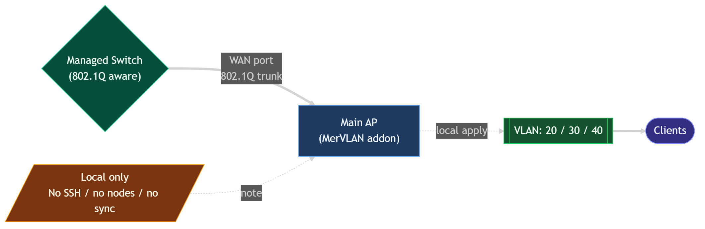
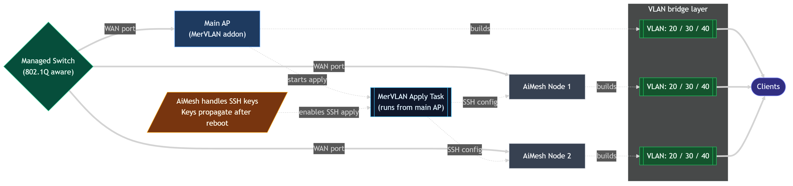
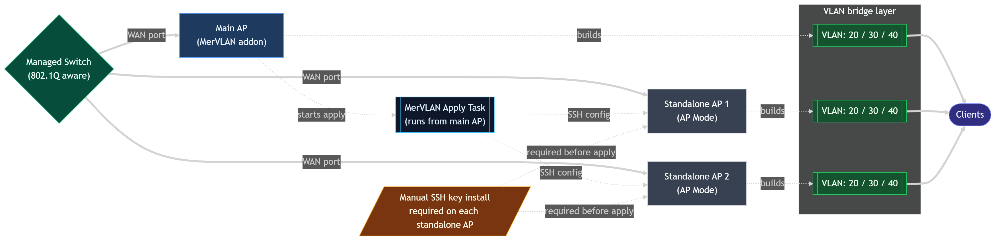
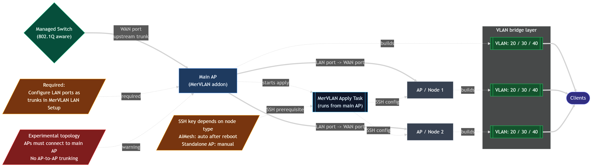

# MerVLAN Help & Usage Guide

MerVLAN is a VLAN management addon for Asuswrt-Merlin. This guide covers setup, multi-node behavior, logs, CLI recovery, device support, and troubleshooting.

<a id="index"></a>

## Index

1. [Getting Started With MerVLAN](#1-getting-started-with-mervlan)
2. [SSID Configuration](#2-ssid-configuration)
3. [LAN Port Configuration](#3-lan-port-configuration)
4. [Applying Your Configuration](#4-applying-your-configuration)
5. [SSH Key Install](#5-ssh-key-install)
6. [Logs & Monitoring](#6-logs--monitoring)
7. [CLI Usage](#7-cli-usage)
8. [Device Support](#8-device-support)
9. [Get Help & Support](#9-get-help--support)
10. [Wiki - Reference & Glossary](#10-wiki---reference--glossary)

<h2 id="1-getting-started-with-mervlan">1. Getting Started With MerVLAN</h2>

MerVLAN is a VLAN management addon for Asuswrt-Merlin. It manages VLAN bridges, ebtables rules, and SSID-to-bridge bindings - locally on a single router or across multiple devices over automated SSH. Below is an overview of the supported network topologies before you start configuring.

### Network Topologies

> [!CAUTION]
> **Wireless backhaul is NOT supported**
>
> Wi-Fi backhaul cannot carry 802.1Q VLAN tags on Asus hardware. **Ethernet backhaul is required between all devices in every topology.** If any device in your setup connects to the main router over Wi-Fi, VLAN traffic will not be isolated correctly and the configuration will not work.

<br>

> **1 - Single Device** <kbd>RECOMMENDED</kbd>
>
> MerVLAN is installed and configured on a single unit. There are no nodes, no SSH apply, and no sync step.  
> This unit connects to a managed switch through its **WAN port** using an 802.1Q VLAN trunk.  
> This is the simplest and most common setup. Use this unless you specifically need VLAN-aware Wi-Fi coverage from additional APs or AiMesh nodes.
>
> <p align="center">  </p>

<br>

> **2 - Single Device with AiMesh Nodes** <kbd>SUPPORTED</kbd>
>
> MerVLAN is installed and configured on the main unit only. AiMesh nodes are added in the Nodes panel.  
> The main unit runs the apply task and reaches the AiMesh nodes over SSH. ASUS firmware propagates the SSH keys to AiMesh nodes after reboot, so the keys do not need to be installed manually on each node.  
> Every unit connects to the managed switch through its **WAN port** using an 802.1Q VLAN trunk.  
> Use this topology when you want MerVLAN-managed VLAN SSIDs on wired AiMesh nodes.
>
> <p align="center">  </p>

<br>

> **3 - Single Device with Standalone APs** <kbd>SUPPORTED</kbd>
>
> MerVLAN is installed and configured on the main unit only. Standalone APs are added as nodes, but they are not part of AiMesh.  
> Because of that, SSH keys must be installed manually on each standalone AP before MerVLAN can configure them.  
> Every unit connects to the managed switch through its **WAN port** using an 802.1Q VLAN trunk.  
> Use this topology when you run separate Asuswrt-Merlin APs instead of AiMesh or mix'n'match units.
>
> <p align="center">  </p>

<br>

> **4 - Nodes Connected Directly to Main Unit** <kbd>EXPERIMENTAL</kbd>
>
> This is an experimental extension of topology 2 or 3. The main unit still connects upstream through its **WAN port**, but downstream APs are plugged directly into selected **LAN ports** on the main unit.  
> Those LAN ports must be configured as 802.1Q trunk ports in MerVLAN's LAN Setup.  
> AP-to-AP and node-to-node trunking is not supported here. Downstream APs must connect directly to the main unit.  
> Use this only if you understand the trunk requirements and are prepared to test carefully.
>
> <p align="center">  </p>

 <br>

### General Settings - Three Toggles

> [!WARNING]
> **Dry Run is on by default**
>
> When you first install MerVLAN, Dry Run mode is enabled. Clicking <kbd>Apply</kbd> simulates the configuration but makes **NO actual changes** to your network.
>
> Before your first real apply: **General Settings -> Disable "Dry Run" -> Save Settings**
> You can re-enable it anytime to safely test a new config before committing it.
### Service Buttons - Boot & Health
Review these three global toggles in the General Settings panel before your first apply.

| Toggle      | Default       | What it does                                                                                                                                                        |
| ----------- | ------------- | ------------------------------------------------------------------------------------------------------------------------------------------------------------------- |
| **DRY RUN** | <kbd>ON</kbd> | Simulates apply without touching the network. Disable when ready to go live.                                                                                        |
| **STP**     | <kbd>OFF</kbd> | Spanning Tree Protocol - prevents loops in multi-node topologies. Leave OFF for single-router setups.                                                               |
| **ENS**     | <kbd>OFF</kbd> | Enable Native SSID - allows VLANs on base radios (wl0, wl1). Most users do not need this; use Guest Network SSIDs instead. See the SSID Setup tab for more details. |
<br>


Boot persistence and the automatic VLAN health monitor are controlled together by three buttons in the General Settings panel.

| Button              | What it does                                                                                                                                                            |
| ------------------- | ----------------------------------------------------------------------------------------------------------------------------------------------------------------------- |
| **Enable Service**  | Injects MerVLAN into `services-start` so VLANs are re-applied on every reboot, and activates the cron-based health monitor on the main router and all configured nodes. |
| **Disable Service** | Removes the `services-start` boot entry and disables the health cron on the main router and all nodes. The service-event heal hook is left in place.                    |
| **Service Status**  | Polls the main router and every configured node and prints their current service state to the CLI log.                                                                  |

**Service Status output example:**

```text
Status:
<--- Main Unit --->
RT-AX95Q boot=enabled addon=active service-event=active cron=present is_node=no
<--- Configured Nodes --->
RT-AX95Q 192.168.186.201:boot=enabled addon=node-on event=active cron=present is_node=yes
```

> [!NOTE]
> **Field meanings:**
> **boot** - enabled/disabled (services-start injection)
> **addon** - active (running on main) - node-on (running on node) - missing (MerVLAN not found)
> **service-event** - active (heal hook installed) - disabled - custom (modified externally)
> **cron** - present (health job scheduled) - absent
> **is_node** - yes/no (indicates if the unit is a node)

### Setup Checklist - Single Router

1. **Review General Settings**
    - Confirm hardware profile detected (shown in the UI badge)
    - Disable Dry Run when ready to apply for real
2. **Configure SSIDs** - see the SSID Setup tab
    - Map each Guest SSID to a VLAN ID and set AP Isolation
3. **Configure LAN Ports** (optional) - see the LAN Setup tab
4. **Save Settings** - click <kbd>Save Settings</kbd>
5. **Apply** - click <kbd>Apply VLAN Manager</kbd> and watch the CLI log

> [!TIP]
> VLANs are now live! Once your config is confirmed working, click **Enable Service** to make it persist across reboots. You can monitor the active VLANs in the INFO panel (see "Logs & Monitoring" for details).

### Setup Checklist - Multi-Node (AiMesh or Full AP)

1. **Install SSH Keys** - click <kbd>SSH Keys Install</kbd>
    - Copy the public key from the CLI log
    - AiMesh nodes: paste the key into the main router's Administration -> System -> Authorized Keys, then reboot each AiMesh node
    - Full AP nodes: paste the key into each AP's Administration -> System -> Authorized Keys individually
2. **Add Your Nodes**
    - Enter each node's IP in the Nodes panel, rename if desired
    - Click <kbd>Save Settings</kbd> before syncing
3. **Sync Nodes** - click <kbd>Sync Nodes</kbd>
    - Copies MerVLAN files to all nodes
    - Trunk config is automatically stripped (main router only)
4. **Configure SSIDs** - map SSIDs to VLANs and assign to the correct nodes
5. **Configure LAN Ports** if needed
6. **Save Settings**
7. **Apply** - choose "Local + Nodes" and watch the CLI log

> [!TIP]
> VLANs are now live! Once your config is confirmed working, click **Enable Service** to make it persist across reboots. You can monitor the active VLANs in the INFO panel (see "Logs & Monitoring" for details).

### Important Tips

- Always **Save** before applying - unsaved changes are not applied
- Start with Dry Run ON to validate your config without risk
- Check the CLI log - it shows exactly what was skipped or failed
- Node Assignment defaults to MAIN; single-router users can ignore it
- VLANs auto-recover after firmware events via the built-in heal system
- During Apply, the unit may be temporarily unresponsive while MerVLAN protects VLAN clients from falling back into `br0`.
- VLAN clients will not appear correctly in ASUS built-in client or traffic views. Use MerVLAN's own VLAN/client views for VLAN-side status.

> [!TIP]
> Ready to configure? Head to **SSID Configuration**.

<br>
<br>
<br>

<h2 id="2-ssid-configuration">2. SSID Configuration <sub><sup><a href="#index">. . . [back to index]</a></sup></sub></h2>

MerVLAN follows this flow for each SSID slot. Up to 12 slots are available - leave a slot blank to skip it.

> [!TIP]
> **Flow:** SSID Name -> VLAN ID -> AP Isolation -> Node Assignment

### SSID Name

- Enter the exact SSID name from your router's Wireless settings
- The SSID must already exist and be enabled - looked up by name
- Leave blank to skip that slot
- Status: <kbd>OK</kbd> Found | <kbd>X</kbd> Not found

> [!IMPORTANT]
> **Guest Network SSIDs are strongly recommended**
>
> Your router has **base radios** (your primary "HomeNet_2G" / "HomeNet_5G" SSIDs) and **Guest Network interfaces** (wl0.1, wl1.1, etc.) created under Wireless -> Guest Network in the Asus UI.
>
> MerVLAN is designed to work with Guest Network SSIDs. Assigning a VLAN to a base radio requires enabling **ENS (Enable Native SSID)** in General Settings. Without ENS, base radio SSIDs are silently skipped with a warning in the log.

> [!NOTE]
> **Why Guest SSIDs are safer - the br0 removal problem**
>
>  When MerVLAN assigns a VLAN to any SSID, it must first remove that wireless interface from `br0` (the router's default LAN bridge) and attach it to a dedicated VLAN bridge instead.
>
>  Guest Network interfaces (wl0.1, wl1.1, etc.) handle this cleanly. **Base radios (wl0, wl1, wl2) do not behave consistently.** Depending on the router model and firmware version, removing a base radio from br0 can trigger the Asus wireless subsystem to:
>
> - Silently move the interface back into br0 on the next wireless event
> - Only partially complete the bridge change, leaving the radio in an inconsistent state
> - Trigger a full wireless restart that drops all clients briefly
>
> **You are free to try base radios with ENS enabled** - some models handle it just fine. But if you notice your main SSID losing VLAN isolation, dropping clients unexpectedly, or the heal system triggering repeatedly, this is most likely why.
>
> **Best practice:** Create a dedicated Guest SSID for each VLAN segment and map those here. Leave your main SSID on the default br0.

### VLAN ID

- Choose a number between 2 and 4094
- Each SSID can have its own VLAN, or share one with another SSID
- Sharing a VLAN ID means both SSIDs join the same network
- Status: <kbd>OK</kbd> Valid | <kbd>Duplicate</kbd> Duplicate detected

### AP Isolation

- <kbd>ON</kbd> - Wireless clients cannot communicate with each other
- <kbd>OFF</kbd> - Clients on the same VLAN can communicate normally
- Recommended ON for Guest and IoT networks
- Recommended OFF for trusted family or work networks
- Only activates once both SSID and VLAN fields are valid

### Node Assignment (Multi-Node Only)

Controls which devices in your network manage each SSID.

- <kbd>MAIN</kbd> = the main router
- <kbd>NODE1-NODE10</kbd> = your configured access points or AiMesh nodes
- Multiple nodes can be selected per SSID
- Nodes without hardware detection are shown greyed out
- Defaults to MAIN - single-router users can ignore this entirely

> [!TIP]
> **Tips:**
>
> - Only select nodes that actually broadcast that SSID.
> - If an SSID is only on a node, deselect MAIN to avoid unnecessary apply time.
> - When in doubt, select all nodes that broadcast the SSID.

### Example Setup

| Slot | SSID       | VLAN | AP Isolation  | Nodes              |
| ---- | ---------- | ---- | ------------- | ------------------ |
| 1    | `IoT_2G`   | 30   | <kbd>ON</kbd> | MAIN, NODE1        |
| 2    | `IoT_5G`   | 30   | <kbd>ON</kbd> | MAIN, NODE1        |
| 3    | `Guest_2G` | 20   | <kbd>ON</kbd> | MAIN               |
| 4    | `Guest_5G` | 20   | <kbd>ON</kbd> | MAIN               |
| 5    | `Kids_2G`  | 40   | <kbd>OFF</kbd> | NODE2             |

Slots 1 and 2 share VLAN 30 - both bands on the same IoT network.

### Status Icons

- <kbd>OK</kbd> - SSID found and valid
- <kbd>X</kbd> - SSID not found in wireless config
- <kbd>Pending</kbd> - edited but not yet saved
- <kbd>Duplicate</kbd> - duplicate VLAN ID (check if intentional)

> [!TIP]
> Next: configure LAN ports if needed.

<br>
<br>
<br>

<h2 id="3-lan-port-configuration">3. LAN Port Configuration <sub><sup><a href="#index">. . . [back to index]</a></sup></sub></h2>

Assign VLANs to physical LAN ports for wired device isolation. A port with the same VLAN as an SSID shares that network with wireless clients on that SSID.

### Port Assignment

For each LAN port, assign a **VLAN ID** (2-4094) or leave blank for the default untagged network. Match an SSID's VLAN to bridge wireless and wired traffic together.

### Trunk Mode (Experimental - Main Router Only)

Trunk mode tags multiple VLANs on a single LAN port. Intended for connecting a managed switch or downstream AP that handles 802.1Q VLAN tagging itself.

- Enable Trunk on a port, then select which VLANs are tagged on it
- Set the native (untagged) VLAN for that port
- Uses strict ebtables VLAN filtering where available

> [!CAUTION]
> **Trunk is main router only**
>
> Trunk configuration is automatically stripped from node settings when you sync or apply "Local + Nodes". Trunk cannot be applied on AiMesh or AP nodes.
>
> Trunk is still experimental. Test thoroughly before relying on it in production.

### Advanced Port Mapping Override (APMO)

If your device's port labels don't match the physical ports, or if the WAN interface was incorrectly detected, use APMO to correct the hardware profile manually.

- Click the <kbd>Experimental</kbd> badge or hardware status indicator in the main UI
- Re-map each ethX interface to the correct LAN port label
- Adjust the WAN interface and port count if needed
- Save - stored in settings.json and persists across MerVLAN updates

See the Device Support tab for the full list of pre-mapped devices.

### Status Icons

- <kbd>OK</kbd> - valid VLAN configured
- <kbd>Unconfigured</kbd> - no VLAN assigned (default network)
- <kbd>Pending</kbd> - edited but not saved
- <kbd>Duplicate</kbd> - duplicate VLAN (check if intentional)
- <kbd>X</kbd> - invalid VLAN ID

### Common Scenarios

> **Scenario 1 - IoT wired + wireless on the same segment**
>
> - SSID `IoT_2G` -> VLAN 30
> - LAN4 -> VLAN 30
> - A wired device on LAN4 joins the same isolated IoT network as wireless clients.

> **Scenario 2 - Full per-port isolation**
>
> - LAN1 -> VLAN 10
> - LAN2 -> VLAN 20
> - LAN3 -> VLAN 30
> - LAN4 -> VLAN 40
> - Every port is its own isolated segment.

> **Scenario 3 - One isolated port, rest default**
>
> - LAN1-LAN3 -> blank/default
> - LAN4 -> VLAN 30
> - Only LAN4 is isolated; the rest of the LAN is unaffected.

> [!TIP]
> Ready to apply? Check the **Apply Changes** section.

<br>
<br>
<br>

<h2 id="4-applying-your-configuration">4. Applying Your Configuration <sub><sup><a href="#index">. . . [back to index]</a></sup></sub></h2>

Once configured, it's time to push your VLANs live.

> [!WARNING]
> **Dry Run is on by default**
>
> MerVLAN ships with Dry Run mode enabled. The full apply pipeline runs - validation, bridge creation, SSID binding - but **NO changes are committed** to the network.
>
> To apply real changes: **General Settings -> Dry Run: Off -> Save Settings -> Apply**
> If nothing seems to change after an apply, look for `[DRY RUN]` lines in the CLI output.

### Apply Modes (Shown When Nodes Are Configured)

| Mode              | What it does                                       | When to use                          |
| ----------------- | -------------------------------------------------- | ------------------------------------ |
| Local Unit Only   | Applies to this router only. Nodes unchanged.      | Testing or debugging the main router |
| **Local + Nodes** | Applies main router first, then all nodes via SSH. | **Normal operation (recommended)**   |
| Nodes Only        | Skips main router, updates nodes only.             | Debugging a specific node            |

Single router: no mode selection - applies immediately.

### Before Applying
<br>

> [!IMPORTANT] 
> **Temporary interruption during Apply is expected** 
> 
> When MerVLAN applies VLAN changes, the unit may become temporarily unresponsive until the apply process is finished. This is expected behavior.
>
> During bridge changes, MerVLAN enables MAC and DHCP guard protection to prevent clients from falling back into `br0` while their VLAN interfaces are being moved. This may briefly interrupt access to the router/AP, but it prevents clients from escaping their assigned VLAN during the transition. 
>
> MerVLAN intentionally prioritizes VLAN isolation over temporary availability during apply.
<br>
1. **Save your configuration** - click <kbd>Save Settings</kbd>. Unsaved changes are NOT applied.
2. **Disable Dry Run** - General Settings -> Dry Run: Off -> Save Settings
3. Click <kbd>Apply VLAN Manager</kbd> - choose apply mode if multi-node, then watch the CLI log.
<br>
> [!TIP]
> If you are configuring Nodes, please continue to the **SSH Key Install** section before applying.
<be>
### What Happens During Apply

1. Hardware profile is validated.
2. SSID names are resolved to wireless interfaces.
3. VLAN bridges are created (`brX` per VLAN ID).
4. SSID interfaces are bound to their VLAN bridges.
5. LAN port VLANs are applied.
6. Multi-node mode pushes settings to nodes and repeats steps 1-5 remotely.
7. Trunk configuration is applied on the main router and always skipped on nodes.

### Boot Persistence & Health Service

By default, VLANs do **NOT** survive a router reboot. Use the Service buttons in General Settings to enable persistence and automatic health monitoring together.

| Button              | Effect                                                                                                     |
| ------------------- | ---------------------------------------------------------------------------------------------------------- |
| **Enable Service**  | Injects boot entry into `services-start` + activates the cron health monitor on main router and all nodes. |
| **Disable Service** | Removes boot entry + disables health cron on main router and all nodes.                                    |
| **Service Status**  | Prints boot, addon, service-event, and cron state for main router and every node.                          |

> [!NOTE]
> The Boot Service (when enabled):
>
> - Waits up to 30s for SSIDs to become available before re-applying VLANs
> - Runs in the background - does not delay other services or slow down boot
> - Logs all activity to `boot_wrap.log`

> [!CAUTION]
> Click **Enable Service** only after your config is confirmed working live. A broken config that runs on boot requires a router restart to clear.

### Troubleshooting

| Problem                        | Solution                                                                                                 |
| ------------------------------ | -------------------------------------------------------------------------------------------------------- |
| Apply runs but nothing changes | Dry Run is likely still ON - look for `[DRY RUN]` in CLI output and disable it in General Settings.      |
| SSIDs not binding              | Verify SSID names match exactly (case-sensitive). If using a base radio, enable ENS in General Settings. |
| Nodes not updating             | Run <kbd>Sync Nodes</kbd> first, then apply. Verify node IPs and SSH keys are installed.                 |
| Port mapping incorrect         | Use APMO to correct the hardware profile (see LAN Setup tab).                                            |
| VLANs lost after reboot        | Service not enabled - click **Enable Service** in General Settings.                                      |

> [!TIP]
> Want to monitor results? Check **Logs & Monitoring**.

<br>
<br>
<br>

<h2 id="5-ssh-key-install">5. SSH Key Install <sub><sup><a href="#index">. . . [back to index]</a></sup></sub></h2>

SSH keys are required for multi-node setups. MerVLAN uses them to connect from the main router to each node and apply VLAN configuration remotely. AiMesh nodes handle key propagation automatically, but standalone nodes (Full APs) require manual installation as MerVLAN cannot inject it automatically.

### How It Works

Clicking <kbd>SSH Keys Install</kbd> generates an ED25519 key pair on the main router and displays the public key in the CLI log. You then copy that key and paste it manually into the Authorized Keys field on each node via the Asus web UI.

> [!NOTE]
> **One-way trust by design**
>
>  The private key lives only on the main router and is never copied to nodes. Nodes hold the public key - this allows the main router to authenticate *to* them via SSH, but nodes cannot SSH back to the main router using this key pair. This is intentional: the main router initiates all connections, and there is no risk of key accumulation or duplicate injection because you control exactly where the public key is pasted.

### Step 1 - Generate the Key Pair

1. Click <kbd>SSH Keys Install</kbd> in the Nodes panel
2. The public key is printed in the CLI log - it is a single line starting with `ssh-ed25519`
3. Copy that full line - you will paste it on each node in the next step

> [!TIP]
> If a key pair already exists, the script reuses it and prints the existing public key. You do not need to re-install it on nodes unless the key was regenerated.

### Step 2 - AiMesh Nodes

For AiMesh nodes that are managed by this router, Asus handles key propagation - but only during the node's boot process.

1. On the **main router**, go to: **Administration -> System -> Authorized Keys**
2. Paste the public key and save
3. **Reboot each AiMesh node** - Asus syncs authorized keys to nodes during their boot; the key will not be active until the node has rebooted

> [!WARNING]
> **AiMesh nodes need a reboot to pick up the key**
>
> The main router does **not** need to be rebooted. Only the AiMesh nodes do. After they come back up, MerVLAN will be able to connect to them via SSH.

### Step 2 - Standalone / Full AP Nodes

Standalone APs running in AP mode are independent devices - they do not receive keys from the main router automatically. You must add the public key to each one individually.

1. On each standalone AP, open its web interface and go to: **Administration -> System -> Authorized Keys**
2. Paste the public key (the `ssh-ed25519 ...` line copied from the CLI log) and save
3. Repeat for every standalone AP node

> [!WARNING]
> **Every standalone AP requires this step individually**
>
> Without the public key on a node, every SSH connection attempt will fail with an authentication error. The CLI log will show `SSH connection failed` for that node. The main router does not need to be rebooted.

### Verifying the Installation

After keys are installed and any required node reboots are done:

- Add each node's IP in the Nodes panel and click <kbd>Save Settings</kbd>
- Click <kbd>Sync Nodes</kbd> and watch the CLI log
- A successful connection shows: `OK SSH connection successful to <IP>`
- A failed connection shows: `SSH connection failed` - key not yet active on that node

### Troubleshooting

| Problem                                                      | Solution                                                                                                              |
| ------------------------------------------------------------ | --------------------------------------------------------------------------------------------------------------------- |
| SSH connection failed on all nodes                           | Re-run <kbd>SSH Keys Install</kbd> to confirm the key exists. Check: `ls /jffs/addons/mervlan/.ssh/`                  |
| AiMesh node still failing after key was added to main router | The AiMesh node needs a reboot - Asus only propagates authorized keys to nodes during their boot process              |
| Standalone AP failing after key was pasted                   | Verify the key was pasted correctly and saved. The key is one line starting with `ssh-ed25519`                        |
| SSH stopped working after a firmware update                  | Firmware updates can wipe JFFS. Re-run <kbd>SSH Keys Install</kbd>, then re-paste the key on all nodes and reboot AiMesh nodes |
| Key already exists message                                   | Normal - MerVLAN reuses an existing key pair. Re-install on nodes only if the key was regenerated                     |

> [!TIP]
> Keys installed? Head to **Apply Changes** to go live.

<br>
<br>
<br>

<h2 id="6-logs--monitoring">6. Logs & Monitoring <sub><sup><a href="#index">. . . [back to index]</a></sup></sub></h2>

MerVLAN provides real-time feedback and persistent logs for every operation.

> [!NOTE]
> **VLAN clients will not appear in ASUS client views**
>
> Clients attached to MerVLAN VLAN bridges will not appear correctly in the built-in ASUS client list, Network Map, or traffic/client monitoring views.
>
> This happens because those ASUS views mostly track clients on the default LAN bridge, `br0`. Once MerVLAN moves a client interface into a dedicated VLAN bridge such as `br20`, `br30`, or `br40`, ASUS no longer see that client through its normal internal collection system.
>
> Use MerVLAN's Active VLANs and client/log views when checking VLAN-connected clients.

### CLI Log (Main Window)

The console shows real-time output during applies and node operations.

- Validation results and configuration warnings
- Apply progress step by step
- SSID bind confirmations and failures
- SSH connection status for each node
- Node filter info - which node is handling which SSID

<kbd>Clear CLI</kbd> clears the console. Output auto-scrolls to the latest entry.

### Full Log Viewer (Separate Window)

Click <kbd>View Full Logs</kbd> for timestamped, persistent logs across all operations. Per-file view: vlan_manager, cli_output, boot_wrap, heal.

Log files on the router (stored in RAM - cleared on reboot):

```text
/tmp/mervlan_tmp/logs/vlan_manager.log
/tmp/mervlan_tmp/logs/cli_output.log
/tmp/mervlan_tmp/logs/boot_wrap.log
```

### Auto-Heal System

MerVLAN monitors VLAN health automatically every minute in the background.

| Phase               | What happens                                                                                   |
| ------------------- | ---------------------------------------------------------------------------------------------- |
| **Phase 1**         | Fast check - single-pass VLAN bridge scan                                                      |
| **Phase 2**         | If fast check fails: 10-pass validation over ~27s (3 consecutive mismatches trigger heal)      |
| **Heal**            | Persistent mismatch -> mervlan_manager.sh re-applies your config automatically                 |
| **Wireless events** | Wait up to 120s for wireless stack to settle + deferred 90s recheck to prevent false positives |

**Log messages you may see:**

```text
"Heal: event [restart_wireless] matched watchlist"
  -> A firmware event triggered a VLAN health check

"VLAN bridges present but wl subinterfaces detected in br0"
  -> Wireless leak detected (race condition) - auto-heal will re-apply

"Heal: VLAN config is healthy - no action needed"
  -> Check passed, everything is intact

"Heal: applying VLAN configuration"
  -> A heal re-apply was triggered

"Heal: scheduling deferred recheck in 90s for [event]"
  -> A wireless event finished; a follow-up check is queued
```

### Active VLANs Panel

Located below the CLI log. Shows which VLAN bridges are live on the main router and each node. Click <kbd>Refresh Active VLANs</kbd> to update. Typical output:

```text
MAIN:  br10  br20  br30
NODE1 (192.168.1.50):  br20  br30
NODE2 (192.168.1.51):  br30
```

> [!NOTE]
> `br0` is the router's default LAN bridge and should NOT appear here. If you only see `br0`, VLANs have not been applied - check that Dry Run is disabled.

### Log Reference

| Log message                              | Meaning                                             |
| ---------------------------------------- | --------------------------------------------------- |
| `OK SSID 'X' resolved to wl1.1`          | OK SSID found and mapped                            |
| `OK Successfully bound to br30`          | OK Interface added to VLAN bridge                   |
| `Filtering SSID identity=MAIN`           | OK Node filter applied correctly                    |
| `Node setup completed successfully`      | OK Remote node apply succeeded                      |
| `Heal: VLAN config is healthy`           | OK Auto-heal check passed                           |
| `SSID 'X' not found on any band`         | Warning: SSID name mismatch or SSID disabled         |
| `Skipping native SSID - ENS not enabled` | Warning: base radio skipped (expected if ENS is OFF) |
| `SSH connection failed`                  | Warning: node SSH key or IP address issue            |
| `Fatal: Hardware profile not ready`      | Warning: device not probed; use APMO                 |
| `wl.* detected in br0`                   | Warning: race condition; auto-heal will re-apply     |

### Debugging Tips

| Symptom                                | What to check                                                          |
| -------------------------------------- | ---------------------------------------------------------------------- |
| VLANs disappear after reboot           | Boot Service is not enabled - enable it in General Settings            |
| Apply runs but VLANs don't appear      | Dry Run is likely still ON - look for `[DRY RUN]` in CLI               |
| VLANs disappear after wireless restart | restart_wireless race condition - auto-heal handles it; check heal log |
| Node not applying                      | View Full Logs for SSH error; run <kbd>Sync Nodes</kbd> then apply again |

> [!TIP]
> Need help? See the **Get Help** tab for support links.

<br>
<br>
<br>

<h2 id="7-cli-usage">7. CLI Usage <sub><sup><a href="#index">. . . [back to index]</a></sup></sub></h2>

These commands are useful when working over SSH on the main router. Most users should use the web UI first; CLI commands are mainly for recovery, manual updates, testing, and advanced troubleshooting.

> [!IMPORTANT]
> **Run commands from the addon directory unless shown otherwise:**
>
> `cd /jffs/addons/mervlan`

### Manual Update Commands

| Command                                     | What it does                                                                  |
| ------------------------------------------- | ----------------------------------------------------------------------------- |
| `sh functions/update_mervlan.sh`            | Update from the stable/main channel.                                          |
| `sh functions/update_mervlan.sh dev`        | Update from the development channel.                                          |
| `sh functions/update_mervlan.sh update dev` | Explicit development-channel update. Same intent as the UI dev update button. |
| `sh functions/update_mervlan.sh restore`    | Open the restore flow and select one of the local MerVLAN backups.            |

> [!NOTE]
> Updates preserve settings, SSH keys, MAC shield databases, and local backups where possible. After updating, the script refreshes the public web UI files and reapplies service hooks.

### Install, Reinstall, and Uninstall

| Command                                               | What it does                                                                                                                                                                      |
| ----------------------------------------------------- | --------------------------------------------------------------------------------------------------------------------------------------------------------------------------------- |
| `sh install.sh full`                                  | Fresh install from the stable/main channel. Downloads the package, installs files, runs hardware probe, and sets up the UI.                                                       |
| `sh install.sh full dev`                              | Fresh install from the development channel.                                                                                                                                       |
| `TMP_DIR=/tmp/mervlan_staging sh install.sh download` | Download a MerVLAN tarball to a staging folder without installing it.                                                                                                             |
| `TMP_DIR=/tmp/mervlan_staging sh install.sh tarball`  | Install from a previously downloaded tarball in the staging folder.                                                                                                               |
| `sh install.sh credentials`                           | Update stored SSH username and SSH port only.                                                                                                                                     |
| `sh uninstall.sh`                                     | Remove the web UI entry and service hooks, but keep the addon files and data.                                                                                                     |
| `sh uninstall.sh full`                                | Full uninstall. Removes web UI, hooks, addon files, data, and node-side install where possible.                                                                                   |
| `sh uninstall.sh && sh install.sh`                    | Manual UI refresh/reinstall from the already-installed local files. Useful after manually changing `mervlan.asp`, public UI files, or install wiring without doing a full update. |

> [!CAUTION]
> **Be careful with full uninstall:** it is intended for a clean removal or clean reinstall. Use normal uninstall + install when you only need to refresh the web UI mount and public files.

### Service and Boot Control

| Command                                     | What it does                                                                                       |
| ------------------------------------------- | -------------------------------------------------------------------------------------------------- |
| `sh functions/mervlan_boot.sh status`       | Show boot, addon, service-event, cron, node, and MAC shield state.                                 |
| `sh functions/mervlan_boot.sh enable`       | Enable MerVLAN at boot and enable the health cron.                                                 |
| `sh functions/mervlan_boot.sh disable`      | Disable boot persistence and tear down active shield chains, while keeping settings and databases. |
| `sh functions/mervlan_boot.sh setupenable`  | Install or repair service-event and services-start hooks.                                          |
| `sh functions/mervlan_boot.sh setupdisable` | Remove MerVLAN hook blocks from service-event and services-start.                                  |
| `sh functions/mervlan_boot.sh cronenable`   | Enable the periodic health check cron job.                                                         |
| `sh functions/mervlan_boot.sh crondisable`  | Disable the periodic health check cron job.                                                        |
| `sh functions/mervlan_boot.sh nodeenable`   | Propagate node service setup to configured nodes over SSH.                                         |
| `sh functions/mervlan_boot.sh nodedisable`  | Remove MerVLAN service hooks from configured nodes over SSH.                                       |

### Manual Apply and Node Operations

| Command                                     | What it does                                                       |
| ------------------------------------------- | ------------------------------------------------------------------ |
| `sh functions/mervlan_manager.sh`           | Apply the current settings locally on the router.                  |
| `sh functions/mervlan_manager.sh --dry-run` | Run the manager without making live network changes.               |
| `sh functions/sync_nodes.sh`                | Copy MerVLAN files and node-filtered settings to configured nodes. |
| `sh functions/execute_nodes.sh`             | Run the node apply workflow over SSH.                              |
| `sh functions/execute_nodes.sh nodesonly`   | Run only the node-side apply workflow.                             |
| `sh functions/hw_probe.sh`                  | Refresh the local hardware profile in settings.json.               |

> [!NOTE]
> The normal UI Apply path handles save, sync, local apply, and node apply in the expected order. Use these CLI commands when debugging or recovering from a partial state.

### Client List and MAC Shield

| Command                                                | What it does                                                                                                                                                             |
| ------------------------------------------------------ | ------------------------------------------------------------------------------------------------------------------------------------------------------------------------ |
| `sh functions/collect_clients.sh`                      | Rebuild the Active VLAN Clients JSON from the main router and configured nodes.                                                                                          |
| `sh functions/mac_refresh.sh`                          | Clear and rebuild the MAC shield database from currently connected VLAN clients. Use after moving devices back to br0 so they do not stay blocked by old shield entries. |
| `sh functions/mac_client_meta.sh`                      | Materialize client display names and MAC shield overrides after metadata changes. Normally triggered by the UI.                                                          |
| `cat /tmp/mervlan_tmp/mac_shield.db`                   | Show the active in-RAM MAC shield database.                                                                                                                              |
| `cat /jffs/addons/mervlan/tmp/mac_shield.db`           | Show the persistent JFFS MAC shield checkpoint.                                                                                                                          |
| `cat /jffs/addons/mervlan/tmp/mac_shield_override.db`  | Show MACs that are unlocked from MAC shield blocking.                                                                                                                    |
| `cat /jffs/addons/mervlan/tmp/client_name_override.db` | Show friendly client-name mappings used by the UI.                                                                                                                       |

### Logs and Quick Debugging

| Command                                              | What it does                                                                    |
| ---------------------------------------------------- | ------------------------------------------------------------------------------- |
| `tail -n 80 /tmp/mervlan_tmp/logs/cli_output.log`    | Show recent CLI output from UI-triggered actions.                               |
| `tail -n 120 /tmp/mervlan_tmp/logs/vlan_manager.log` | Show recent manager, heal, MAC shield, and service logs.                        |
| `tail -n 80 /tmp/mervlan_tmp/logs/boot_wrap.log`     | Show recent boot wrapper activity.                                              |
| `cat /tmp/mervlan_tmp/results/vlan_clients.json`     | View the generated client inventory JSON used by the Active VLAN Clients panel. |
| `: > /tmp/mervlan_tmp/logs/cli_output.log`           | Clear the CLI output log manually.                                              |

> [!CAUTION]
> **Do not run `service-event-handler.sh` directly.** It expects firmware-provided service-event variables and is meant to be called by Asuswrt-Merlin, not by hand.

<br>
<br>
<br>

<h2 id="8-device-support">8. Device Support <sub><sup><a href="#index">. . . [back to index]</a></sup></sub></h2>

MerVLAN includes built-in hardware profiles for a growing range of Asuswrt-Merlin routers. Each profile maps physical LAN ports to the correct kernel interfaces (ethX) and identifies the WAN port.

### Fully Supported Devices

| Model         | LAN Ports  | Notes                                                         |
| ------------- | ---------- | ------------------------------------------------------------- |
| GT-AX6000     | 5          |                                                               |
| RT-AX86U      | 5          |                                                               |
| RT-AX86U Pro  | 5          |                                                               |
| RT-AX88U      | 5          |                                                               |
| RT-AX86S      | 4          |                                                               |
| RT-AX92U      | 4          |                                                               |
| RT-AC86U      | 4          |                                                               |
| RT-AX82U      | 4          |                                                               |
| RT-AX5400     | 4          |                                                               |
| RT-AX58U      | 4          |                                                               |
| TUF-AX3000_V2 | 4          |                                                               |
| RT-AX95Q      | 3          |                                                               |
| RT-AXE95Q     | 3          |                                                               |
| RT-ET8        | 3          |                                                               |
| RT-BE92U      | 1 (shared) | LAN 1-4 share one VLAN bridge - no per-port isolation |

These devices are auto-detected on startup - no manual configuration needed. More profiles are added with each release.

> [!WARNING]
> **RT-BE92U hardware limitation**
>
> Due to the internal switch design on this model, all four physical LAN ports share a single VLAN-capable interface. Only one VLAN ID can be assigned and it applies to LAN 1-4 as a group. Per-port VLAN isolation is not supported on this model.

### If Your Device Is Not Listed

MerVLAN will still attempt to run, but port assignments may be incorrect or incomplete. Use the APMO modal to configure your hardware profile manually.

**How to access APMO:**

- Click the <kbd>Experimental</kbd> badge or hardware status indicator in the main UI header

**In the APMO modal you can:**

- Map each ethX interface to the correct LAN port label
- Set the correct WAN interface (e.g., eth0 or eth4)
- Confirm the LAN port count
- Save the profile - stored in settings.json, persists across MerVLAN updates

**Tips for identifying your port layout:**

- Connect one device at a time to each LAN port and note the interface
- Check the Asus product page for your model's port-to-chip mapping
- Ask on Discord or SNB Forums - others may have already mapped your device

### Skipping APMO

Without a hardware profile, MerVLAN will guess port mappings from available interfaces. This may lead to:

- Wrong VLAN assigned to the wrong physical port
- WAN port misidentified - **this breaks internet connectivity**
- Trunk configuration applied on the wrong interface
- SSIDs binding correctly while wired VLANs fail silently

At minimum, verify the WAN interface is correct before applying.

### Sharing Your Profile

Got a working APMO profile for an unlisted device? Please share it - it can be built into a future release.

- Post the ethX mapping on SNB Forums or Discord
- Open a GitHub Issue with your PRODUCTID and port layout
- Include firmware version and your test results

See the "Get Help" tab for all links.

<br>
<br>
<br>

<h2 id="9-get-help--support">9. Get Help & Support <sub><sup><a href="#index">. . . [back to index]</a></sup></sub></h2>

Need help? Found a bug? Have a feature idea? The MerVLAN community is active and happy to assist.

> [!IMPORTANT]
> **Bugs and broken features -> GitHub Issues, please**
>
> If you've found a bug, a broken feature, or something that behaves unexpectedly, please report it on [GitHub Issues](https://github.com/r80xcore/mervlan/issues) rather than the forums or Discord. Having everything in one place makes it much easier to track, prioritise, and avoid duplicates - and nothing gets lost in a chat scroll.
>
> SNB and Discord are great for setup questions and general help. GitHub is the right place for anything that needs to be fixed.

> **SNB Forums** - Community Discussion
>
> _Best for: setup questions, config examples, community tips_
>
> [snbforums.com - MerVLAN thread](https://www.snbforums.com/threads/mervlan-v0-52-1-dev-0-52-7-simple-and-powerful-vlan-management-beta.95936/)
>
> - Active community with developer responses
> - Real-world setup guides and configuration examples
> - Feature discussions and general networking advice

> **Discord** - Real-Time Chat
>
> _Best for: quick questions, live troubleshooting, pre-release chat_
>
> [discord.com/invite/8c3C8q54hn](https://discord.com/invite/8c3C8q54hn)
>
> - Direct access to developers
> - Fast community support
> - Easy log sharing and screenshot-based debugging

> **GitHub Issues** - Bug Reports & Feature Requests
>
> _Best for: reproducible bugs, formal feature requests_
>
> [github.com/r80xcore/mervlan/issues](https://github.com/r80xcore/mervlan/issues)
>
> - Search existing issues first - it may already be reported
> - Include device model, Merlin firmware version, and logs
> - Describe steps to reproduce and note features in use (trunk, ENS, APMO)

### What to Include When Asking for Help

| Category   | Details to include                                                                                               |
| ---------- | ---------------------------------------------------------------------------------------------------------------- |
| **Device** | Router model, Merlin firmware version, router mode (Router / AP / AiMesh node)                                   |
| **Config** | Number of SSIDs and VLANs, whether you're using Trunk, ENS, APMO, or multi-node                                  |
| **Logs**   | CLI output from the main window + full logs from <kbd>View Full Logs</kbd>. For node issues, include that node's section. |

### Quick Self-Help Checklist

Before posting, run through these:

- Is Dry Run disabled? *(most common issue for new users)*
- Did you click <kbd>Save Settings</kbd> before applying?
- Do SSID names match exactly? *(case-sensitive)*
- Did you run <kbd>Sync Nodes</kbd> before applying to nodes?
- Is Boot Service enabled if you need persistence?
- Did you check <kbd>View Full Logs</kbd> for error lines?
- Have you tried a reboot if something seems stuck?

### Contributing

- Share your APMO hardware profile for unlisted devices
- Report bugs with full logs and firmware version
- Test pre-release builds and share feedback on Discord
- Star the GitHub repo to help with visibility

Happy VLANing!

<br>
<br>
<br>

<h2 id="10-wiki---reference--glossary">10. Wiki - Reference & Glossary <sub><sup><a href="#index">. . . [back to index]</a></sup></sub></h2>

Background reference for MerVLAN. Step-by-step guides are in the other tabs - this page covers what each script does, how they connect, and what technical terms mean.

### Scripts

MerVLAN is built from several shell scripts, each with a single responsibility.

| Script                     | What it does                                                                                                                                                                                                 |
| -------------------------- | ------------------------------------------------------------------------------------------------------------------------------------------------------------------------------------------------------------ |
| `mervlan_manager.sh`       | The core apply engine. Resolves SSIDs to wireless interfaces, creates per-VLAN bridges, binds interfaces to those bridges, and applies LAN port VLANs. Called during apply, on boot, and by the heal system. |
| `mervlan_trunk.sh`         | Handles trunk port configuration on the main router. Applies 802.1Q VLAN tagging rules on the designated LAN port. Called by the manager.                                                                    |
| `mervlan_boot_wrap.sh`     | The boot entry point called by services-start on reboot. Waits up to 30s for wireless interfaces to become available, then calls mervlan_boot.sh.                                                            |
| `mervlan_boot.sh`          | Orchestrates the boot sequence. Calls the manager to re-apply VLANs and handles node boot coordination over SSH.                                                                                             |
| `service-event-handler.sh` | Intercepts Asus firmware service events (e.g. restart_wireless). Forwards events that can affect VLAN state to the heal system.                                                                              |
| `heal_event.sh`            | The VLAN health monitor. Runs every minute via cron. Checks whether bridges and interface bindings are intact. Triggers a re-apply via the manager if a persistent fault is detected.                        |
| `sync_nodes.sh`            | Copies MerVLAN files to each configured node over SSH. Rewrites settings.json per node before sending - trunk config is stripped and the node flag is set on the remote copy.                                |
| `execute_nodes.sh`         | Runs mervlan_manager.sh on each remote node via SSH. Used during "Local + Nodes" applies and remote enable/disable service commands.                                                                         |
| `dropbear_sshkey_gen.sh`   | Generates the ED25519 key pair used for all node SSH connections. Stores keys in `/jffs/addons/mervlan/.ssh/`.                                                                                               |
| `hw_probe.sh`              | Probes the device to detect its hardware profile - identifies ethX interfaces, port count, and the WAN port.                                                                                                 |
| `device_support_mapper.sh` | Maps detected interfaces to physical port labels using the built-in device database. Flags the device for APMO if it is not recognized.                                                                      |
| `save_settings.sh`         | Receives form data submitted from the UI and writes it to settings.json on the router.                                                                                                                       |
| `collect_clients.sh`       | Gathers connected client data from the main router and all nodes for the Clients Overview panel in the UI.                                                                                                   |

### How the Scripts Connect

> **Apply - single router**
>
> UI saves via save_settings.sh -> settings.json updated -> mervlan_manager.sh applies bridges and bindings -> mervlan_trunk.sh applies trunk config (if enabled)

> **Apply - with nodes**
>
> mervlan_manager.sh (local) -> sync_nodes.sh pushes files to each node -> execute_nodes.sh runs mervlan_manager.sh on each node remotely

> **Boot - after reboot**
>
> services-start -> mervlan_boot_wrap.sh (waits for SSIDs) -> mervlan_boot.sh -> mervlan_manager.sh

> **Health monitoring - every minute**
>
> cron -> heal_event.sh checks VLAN state -> mervlan_manager.sh re-applies if a fault persists

> **Firmware event - e.g. wireless restart**
>
> Asus firmware fires service-event -> service-event-handler.sh intercepts -> heal_event.sh runs a health check -> mervlan_manager.sh re-applies if needed

### Glossary

Technical terms used across the guide, in plain language.

| Term                 | Meaning                                                                                                                                                                                           |
| -------------------- | ------------------------------------------------------------------------------------------------------------------------------------------------------------------------------------------------- |
| **802.1Q**           | IEEE standard for VLAN tagging on Ethernet frames. A small tag is added to each frame to indicate which VLAN it belongs to. Required by trunk ports and managed switches.                         |
| **AiMesh**           | Asus's mesh networking system. AiMesh nodes are managed by the main router and receive SSH authorized keys from it automatically after a reboot.                                                  |
| **APMO**             | Advanced Port Mapping Override. Lets you manually correct the hardware profile when automatic detection is wrong or the device is not in the built-in database.                                   |
| **Authorized Keys**  | A file on each router listing SSH public keys that are allowed to connect without a password. MerVLAN's public key must be present here on every node.                                            |
| **Base radio**       | The primary wireless interface for a band - wl0 (2.4 GHz), wl1 (5 GHz), wl2 (6 GHz). Assigning VLANs to base radios is possible but less stable than using Guest Network SSIDs.                   |
| **br0**              | The router's default LAN bridge. All interfaces are in br0 out of the box. MerVLAN moves relevant interfaces out of br0 and into dedicated per-VLAN bridges during apply.                         |
| **Cron**             | A time-based job scheduler built into the router OS. MerVLAN's health monitor runs as a cron job every minute when the service is enabled.                                                        |
| **Dropbear**         | The SSH server and client built into Asuswrt-Merlin. MerVLAN uses Dropbear's SSH client to connect from the main router to nodes.                                                                 |
| **Dry Run**          | A MerVLAN mode where the full apply pipeline runs but no changes are committed to the network. ON by default - used to safely validate a config before going live.                                |
| **ebtables**         | A packet filtering tool that works at Layer 2 (Ethernet level). MerVLAN uses it to enforce VLAN isolation and quarantine rules on network bridges.                                                |
| **ED25519**          | A modern SSH key algorithm. The type of key MerVLAN generates for authenticating from the main router to nodes.                                                                                   |
| **ENS**              | Enable Native SSID. A MerVLAN toggle that allows VLANs to be assigned to base radios. OFF by default - Guest Network SSIDs are recommended instead.                                               |
| **ethX**             | Kernel names for Ethernet interfaces (eth0, eth1, eth2, etc.). Each physical LAN and WAN port on the router maps to one of these internally.                                                      |
| **Guest SSID**       | A secondary Wi-Fi network created under Wireless -> Guest Network in the Asus UI. Uses a separate virtual interface (wl0.1, wl1.1, etc.) and is the recommended type for VLAN assignment.         |
| **Hardware profile** | A device-specific map of ethX interfaces to physical port labels, including which port is the WAN. MerVLAN needs this to know where to apply VLAN rules.                                          |
| **JFFS**             | A writable flash filesystem on Asus routers, mounted at /jffs. Where MerVLAN is installed, settings are stored, and SSH keys live. Can be wiped by a factory reset or firmware update.            |
| **Node**             | A secondary router or access point managed remotely by MerVLAN over SSH. Runs its own instance of MerVLAN in node mode.                                                                           |
| **Service event**    | A firmware-generated signal that something changed on the router - for example, restart_wireless or dhcpc-up. MerVLAN monitors these to detect when VLAN state may have been disrupted.           |
| **services-start**   | An Asuswrt-Merlin script that runs automatically when the router finishes booting. MerVLAN injects a call here to re-apply VLANs on every reboot.                                                 |
| **SSH**              | Secure Shell. An encrypted protocol for running commands on a remote device. MerVLAN uses SSH to sync files and run the VLAN manager on nodes.                                                    |
| **SSID**             | Service Set Identifier. The name of a Wi-Fi network as seen when scanning for networks.                                                                                                           |
| **STP**              | Spanning Tree Protocol. Prevents network loops in topologies where multiple paths exist between devices. Relevant in multi-node setups with redundant links - leave OFF for single-router setups. |
| **Trunk port**       | An Ethernet port configured to carry tagged traffic for multiple VLANs simultaneously using 802.1Q. Requires a managed switch or downstream device that understands VLAN tags.                    |
| **VLAN**             | Virtual Local Area Network. Logically divides one physical network into isolated segments. Devices on different VLANs cannot communicate unless explicitly routed between them.                   |
| **VLAN bridge**      | A kernel network bridge dedicated to one VLAN (e.g. br20 for VLAN 20). MerVLAN creates one per VLAN ID and attaches the relevant wireless and wired interfaces to it.                             |
| **VLAN ID**          | A number between 2 and 4094 that identifies a specific VLAN. Interfaces and ports sharing the same VLAN ID are on the same network segment.                                                       |
| **WAN**              | Wide Area Network - the internet-facing port on the router. MerVLAN must correctly identify this port to avoid applying VLAN rules to it by mistake.                                              |
