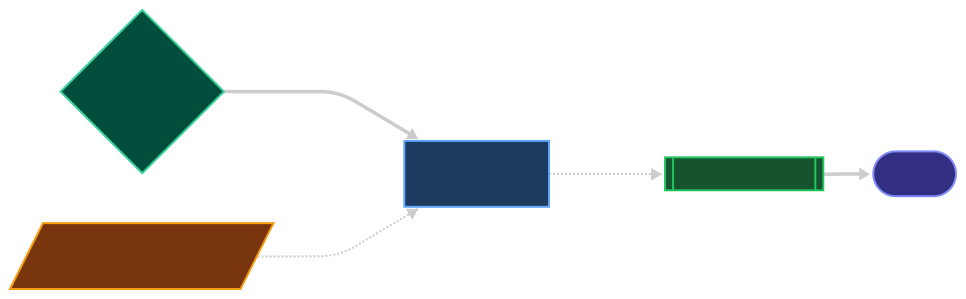
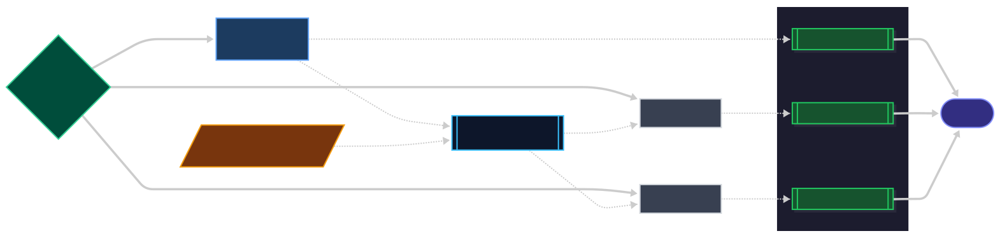
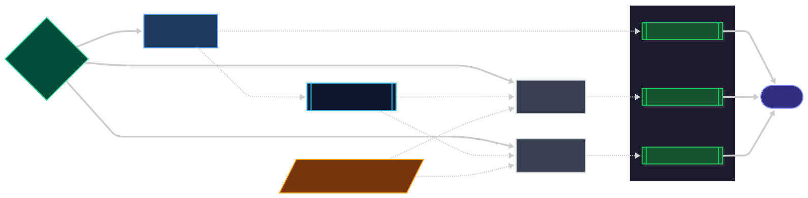
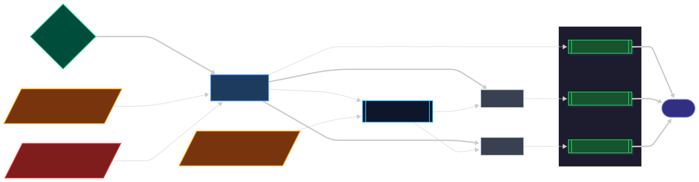

<p align="center">
  
</p>

#

MerVLAN is a VLAN management addon for Asuswrt-Merlin. This guide covers setup, multi-node behavior, logs, CLI recovery, device support, and troubleshooting.

<a id="index"></a>

## Index

1. [Getting Started With MerVLAN](#1-getting-started-with-mervlan)
2. [SSID Configuration](#2-ssid-configuration)
3. [LAN Port Configuration](#3-lan-port-configuration)
4. [WAN Native VLAN](#4-wan-native-vlan)
5. [Applying Your Configuration](#5-applying-your-configuration)
6. [SSH Key Install](#6-ssh-key-install)
7. [Logs & Monitoring](#7-logs--monitoring)
8. [Updating or Restoring MerVLAN](#8-updating-or-restoring-mervlan)
9. [CLI Usage](#9-cli-usage)
10. [Device Support](#10-device-support)
11. [Get Help & Support](#11-get-help--support)
12. [Wiki - Reference & Glossary](#12-wiki---reference--glossary)

<h2 id="1-getting-started-with-mervlan">1. Getting Started With MerVLAN <sub><sup><a href="#index">. . . [back to index]</a></sup></sub></h2>

MerVLAN adds VLAN configuration to Asuswrt-Merlin APs and can manage one device or multiple nodes over SSH. Start by choosing the topology that matches your network.

### Network Topologies

> [!CAUTION]
> **Wireless backhaul is NOT supported**
>
> Wi-Fi backhaul cannot carry 802.1Q VLAN tags on Asus hardware. **Ethernet backhaul is required between all devices in every topology.** If any device in your setup connects to the main router over Wi-Fi, VLAN traffic will not be isolated correctly and the configuration will not work.

> [!IMPORTANT]
> **Static IP addresses are mandatory for APs/nodes**
>
> Static IP addresses are required for all APs/nodes, both AiMesh and standalone, to ensure stable configuration. MerVLAN uses SSH to sync and apply configuration to nodes. Give each AP/node a fixed IP address or DHCP reservation before configuring MerVLAN.
> 
<br>

> **1 - Single Device** <kbd>RECOMMENDED</kbd>
>
> MerVLAN is installed and configured on a single unit. There are no nodes, no SSH apply, and no sync step.  
> This unit connects to a managed switch through its **WAN port** using an 802.1Q VLAN trunk.  
> This is the simplest and most common setup. Use this unless you specifically need VLAN-aware Wi-Fi coverage from additional APs or AiMesh nodes.
>
> <p align="center">  </p>

<br>

> **2 - Single Device with AiMesh Nodes** <kbd>SUPPORTED</kbd>
>
> MerVLAN is installed and configured on the main unit only. AiMesh nodes are added in the Nodes panel.  
> The main unit runs the apply task and reaches the AiMesh nodes over SSH. ASUS firmware propagates the SSH keys to AiMesh nodes after reboot, so the keys do not need to be installed manually on each node.  
> Every unit connects to the managed switch through its **WAN port** using an 802.1Q VLAN trunk.  
> Use this topology when you want MerVLAN-managed VLAN SSIDs on wired AiMesh nodes.
>
> <p align="center">  </p>

<br>

> **3 - Single Device with Standalone APs** <kbd>SUPPORTED</kbd>
>
> MerVLAN is installed and configured on the main unit only. Standalone APs are added as nodes, but they are not part of AiMesh.  
> Because of that, SSH keys must be installed manually on each standalone AP before MerVLAN can configure them.  
> Every unit connects to the managed switch through its **WAN port** using an 802.1Q VLAN trunk.  
> Use this topology when you run separate Asuswrt-Merlin APs instead of AiMesh or mix'n'match units.
>
> <p align="center">  </p>

<br>

> **4 - Nodes Connected Directly to Main Unit** <kbd>EXPERIMENTAL</kbd>
>
> This is an experimental extension of topology 2 or 3. The main unit still connects upstream through its **WAN port**, but downstream APs are plugged directly into selected **LAN ports** on the main unit.  
> Those LAN ports must be configured as 802.1Q trunk ports in MerVLAN's LAN Setup.  
> MerVLAN supports one trunk hop from the **MAIN** unit to a directly connected **NODE**.  
> Trunking from one **NODE** to another **NODE** is not supported. Every downstream node using this topology must connect directly to the main unit.  
> Use this only if you understand the trunk requirements and are prepared to test carefully.
>
> <p align="center">  </p>

 <br>

<a id="settings-modal"></a>

### Settings Modal

> [!WARNING]
> **Dry Run is on by default**
>
> When you first install MerVLAN, Dry Run is enabled. Clicking <kbd>Apply VLAN</kbd> checks and simulates the configuration but makes **no network changes**.
>
> Before your first real apply: **Settings → Dry Run: Off → Apply**, then click <kbd>Apply VLAN</kbd>.
> You can re-enable it anytime to safely test a new config before committing it.

Open <kbd>Settings</kbd> from the main MerVLAN page and review these options before your first apply.

| Setting or control | Default | What it does |
| --- | --- | --- |
| **Enable STP** | <kbd>OFF</kbd> | Enables Spanning Tree Protocol to prevent loops in multi-node topologies. Leave it off for normal single-router setups. |
| **Dry Run** | <kbd>ON</kbd> | Simulates apply without changing the network. Disable it when you are ready to go live. |
| **Enable Native SSID (ENS)** | <kbd>OFF</kbd> | Allows VLANs on base radios such as wl0 and wl1. Most users should use Guest Network SSIDs instead. |
| **Apply on Boot** | <kbd>OFF</kbd> | Re-applies MerVLAN after a reboot and enables automatic health checks on the main router and configured nodes. Enable it only after confirming that your live configuration works. |
| **Pause Event Reactions** | <kbd>OFF</kbd> | Temporarily suppresses router-triggered rebuilds while making bulk ASUS Wi-Fi changes. UI actions still work, and pause is cleared automatically on reboot. Sync nodes after changing it. |
| **Experimental Features** | <kbd>OFF</kbd> | Enables features that are still under active testing. |
| **Boot service status** | &mdash; | Shows whether Apply on Boot is currently enabled or disabled. |
| **Refresh (&#x27F3;)** | &mdash; | Checks boot, addon, health service, and MAC Shield status on the main router and configured nodes. Detailed results are also written to the command output. |

Click <kbd>Apply</kbd> to save changes made in this window. While the save is running, the controls are temporarily locked. A successful save leaves the window open and displays `Settings Saved!`. If the main router succeeds but a configured node fails, MerVLAN reports partial success and keeps the setting that was applied successfully on the main router.

### Setup Checklist - Single Router

1. **Review Settings**
    - Confirm that the hardware profile was detected.
    - Leave Dry Run on while checking the configuration. Turn it off only when you are ready for a real apply.
2. **Configure SSIDs** - map each Guest SSID to a VLAN ID. See [SSID Configuration](#2-ssid-configuration).
3. **Configure LAN Ports** if needed. See [LAN Port Configuration](#3-lan-port-configuration).
4. **Save** - click <kbd>Save</kbd>. Unsaved changes are not applied.
5. **Apply** - click <kbd>Apply VLAN</kbd> and watch the command output.

### Setup Checklist - Multi-Node (AiMesh or Standalone AP)

1. **Install SSH Keys** - follow [SSH Key Install](#6-ssh-key-install).
2. **Add Your Nodes**
    - Enter each node's IP in the Nodes panel and rename it if desired.
    - Click <kbd>Save</kbd> before syncing.
3. **Sync Nodes** - click <kbd>Sync Nodes</kbd> to copy MerVLAN and detect node hardware.
4. **Configure SSIDs** - map SSIDs to VLANs and assign them to the correct devices.
5. **Configure LAN Ports** - use the numbered node selectors if a node needs wired VLANs.
6. Click <kbd>Save</kbd>, then <kbd>Sync Nodes</kbd> again after changing the configuration.
7. **Apply** - click <kbd>Apply VLAN</kbd>, choose <kbd>Router + Nodes</kbd>, and watch the command output.

> [!IMPORTANT]
> After either setup works correctly with Dry Run off, open <kbd>Settings</kbd>, enable **Apply on Boot**, and click <kbd>Apply</kbd>. This makes the configuration survive a reboot and enables automatic health checks. See [Logs & Monitoring](#7-logs--monitoring) to verify the result.

### Important Tips

- Check the command output after saving, syncing, or applying. It shows what succeeded, was skipped, or failed.
- Node Assignment defaults to MAIN; single-router users can ignore it.
- When Apply on Boot is enabled, MerVLAN checks the configuration after relevant firmware events and repairs it when needed.
- During Apply, the unit may be temporarily unresponsive while MerVLAN protects VLAN clients from falling back into `br0`.
- VLAN clients will not appear correctly in ASUS built-in client or traffic views. Use MerVLAN's own VLAN/client views for VLAN-side status.

> [!TIP]
> Ready to configure? Continue to [SSID Configuration](#2-ssid-configuration).

---

<h2 id="2-ssid-configuration">2. SSID Configuration <sub><sup><a href="#index">. . . [back to index]</a></sup></sub></h2>

MerVLAN follows this flow for each available SSID slot. The number of slots depends on the radios and wireless interfaces supported by the device. Leave a slot blank to skip it.

> [!TIP]
> **Flow:** SSID Name → VLAN ID → AP Isolation → Node Assignment

### SSID Name

- Enter the exact SSID name from your router's Wireless settings
- The SSID must already exist and be enabled - looked up by name
- Leave blank to skip that slot
- Status: <kbd>OK</kbd> Found | <kbd>X</kbd> Not found

> [!IMPORTANT]
> **Guest Network SSIDs are strongly recommended**
>
> Your router has **base radios** (your primary "HomeNet_2G" / "HomeNet_5G" SSIDs) and **Guest Network interfaces** (wl0.1, wl1.1, etc.) created under Wireless → Guest Network in the Asus UI.
>
> MerVLAN is designed to work with Guest Network SSIDs. Assigning a VLAN to a base radio requires enabling **Enable Native SSID (ENS)** in the Settings modal. Without ENS, base radio SSIDs are silently skipped with a warning in the log.

> [!NOTE]
> MerVLAN must move a selected wireless interface out of the default `br0` bridge. Guest interfaces normally handle this reliably, while base radios can be moved back by ASUS wireless events on some models. If a base-radio VLAN loses isolation or repeatedly triggers recovery, use a dedicated Guest SSID instead.

### VLAN ID

- Choose a number between 2 and 4094
- Each SSID can have its own VLAN, or share one with another SSID
- Sharing a VLAN ID means both SSIDs join the same network
- Status: <kbd>OK</kbd> Valid | <kbd>Duplicate</kbd> Duplicate detected

### AP Isolation

- <kbd>ON</kbd> - Wireless clients cannot communicate with each other
- <kbd>OFF</kbd> - Clients on the same VLAN can communicate normally
- Recommended ON for Guest and IoT networks
- Recommended OFF for trusted family or work networks
- Only activates once both SSID and VLAN fields are valid

### Node Assignment (Multi-Node Only)

Controls which devices in your network manage each SSID.

- <kbd>MAIN</kbd> = the main router
- <kbd>NODE1-NODE10</kbd> = your configured access points or AiMesh nodes
- Multiple nodes can be selected per SSID
- Nodes without hardware detection are shown greyed out
- Defaults to MAIN - single-router users can ignore this entirely

> [!TIP]
> **Tips:**
>
> - Only select nodes that actually broadcast that SSID.
> - If an SSID is only on a node, deselect MAIN to avoid unnecessary apply time.
> - When in doubt, select all nodes that broadcast the SSID.

### Example Setup

| Slot | SSID       | VLAN | AP Isolation  | Nodes              |
| ---- | ---------- | ---- | ------------- | ------------------ |
| 1    | `IoT_2G`   | 30   | <kbd>ON</kbd> | MAIN, NODE1        |
| 2    | `IoT_5G`   | 30   | <kbd>ON</kbd> | MAIN, NODE1        |
| 3    | `Guest_2G` | 20   | <kbd>ON</kbd> | MAIN               |
| 4    | `Guest_5G` | 20   | <kbd>ON</kbd> | MAIN               |
| 5    | `Kids_2G`  | 40   | <kbd>OFF</kbd> | NODE2             |

Slots 1 and 2 share VLAN 30 - both bands on the same IoT network.

### Status Icons

- <kbd>OK</kbd> - SSID found and valid
- <kbd>X</kbd> - SSID not found in wireless config
- <kbd>Pending</kbd> - edited but not yet saved
- <kbd>Duplicate</kbd> - duplicate VLAN ID (check if intentional)

> [!TIP]
> Next, configure [LAN ports](#3-lan-port-configuration) if needed.

---

<h2 id="3-lan-port-configuration">3. LAN Port Configuration <sub><sup><a href="#index">. . . [back to index]</a></sup></sub></h2>

Assign VLANs to physical LAN ports for wired device isolation. A port with the same VLAN as an SSID shares that network with wireless clients on that SSID.

### Port Assignment

For each LAN port, assign a **VLAN ID** (2-4094) or leave blank for the default untagged network. Match an SSID's VLAN to bridge wireless and wired traffic together.

### Main and Node Port Assignments

Use <kbd>Main</kbd> or a numbered node selector above the LAN table to choose which device you are editing. Each node has its own port assignments; the main router's values are not used as automatic defaults on nodes.

If a node is unavailable in the selector, configure its IP, click <kbd>Save</kbd>, and run <kbd>Sync Nodes</kbd> so MerVLAN can detect its hardware. After changing a node's ports, click <kbd>Save</kbd> and run <kbd>Sync Nodes</kbd> again before applying.

### Trunk Mode (Experimental - Main Router Only)

Trunk mode tags multiple VLANs on a single LAN port. Intended for connecting a managed switch or downstream AP that handles 802.1Q VLAN tagging itself.

- Enable Trunk on a port, then select which VLANs are tagged on it
- Set the native (untagged) VLAN for that port
- Uses strict ebtables VLAN filtering where available

> [!CAUTION]
> **Trunk is main router only**
>
> Trunk configuration is automatically stripped from node settings when you sync or apply <kbd>Router + Nodes</kbd>. Trunk cannot be applied on AiMesh or standalone AP nodes.
>
> Trunk is still experimental. Test thoroughly before relying on it in production.

<a id="apmo"></a>

### Advanced Port Mapping Override (APMO)

If your device's port labels don't match the physical ports, or if the WAN interface was incorrectly detected, use APMO to correct the hardware profile manually.

Open <kbd>APMO</kbd> from the main UI. See [Device Support](#10-device-support) for instructions and the full list of pre-mapped devices.

### Status Icons

- <kbd>OK</kbd> - valid VLAN configured
- <kbd>Unconfigured</kbd> - no VLAN assigned (default network)
- <kbd>Pending</kbd> - edited but not saved
- <kbd>Duplicate</kbd> - duplicate VLAN (check if intentional)
- <kbd>X</kbd> - invalid VLAN ID

### Common Scenarios

> **Scenario 1 - IoT wired + wireless on the same segment**
>
> - SSID `IoT_2G` → VLAN 30
> - LAN4 → VLAN 30
> - A wired device on LAN4 joins the same isolated IoT network as wireless clients.

> **Scenario 2 - Full per-port isolation**
>
> - LAN1 → VLAN 10
> - LAN2 → VLAN 20
> - LAN3 → VLAN 30
> - LAN4 → VLAN 40
> - Every port is its own isolated segment.

> **Scenario 3 - One isolated port, rest default**
>
> - LAN1-LAN3 → blank/default
> - LAN4 → VLAN 30
> - Only LAN4 is isolated; the rest of the LAN is unaffected.

> [!TIP]
> Next, configure [WAN Native VLAN](#4-wan-native-vlan) if needed, or continue to [Applying Your Configuration](#5-applying-your-configuration).

---

<h2 id="4-wan-native-vlan">4. WAN Native VLAN <sub><sup><a href="#index">. . . [back to index]</a></sup></sub></h2>

<a id="wan-native"></a>

> [!WARNING]
> It is **highly recommended** to disable **Apply on boot** while testing the *WAN Native VLAN* configuration.\
> **Reason**: *Should the unit become unresponsive or misconfigured, a simple power cycle will safely **restore it**.*

WAN Native VLAN moves the normal ASUS/native `br0` management network from the default untagged uplink path onto a **tagged VLAN**.

MerVLAN does not inject or hijack traffic; it wraps the existing ASUS native `br0` uplink with a tagged VLAN layer. ASUS continues to use its normal `br0` management bridge, while MerVLAN changes the transport underneath it:

| Mode | `br0` path | Uplink traffic on wire |
| --- | --- | --- |
| ASUS/default | `br0 → WAN/uplink` | Untagged/native |
| WAN Native VLAN 190 | `br0 → WAN/uplink.190 → WAN/uplink` | Tagged VLAN 190 |

Leave WAN Native as **ASUS** (the default) unless the upstream switch and DHCP server are prepared for the selected VLAN. MerVLAN does **NOT** assign static IP addresses; it uses the configured addresses to reconnect and verify devices during transitions.

---

### Preparation

Before enabling numeric WAN Native on MAIN:

> [!WARNING]
> **Automatic LAN IP is strictly mandatory!**\
> *WAN Native VLAN will not work unless the unit is set to receive its IP automatically.*

1. Go to **LAN** → **LAN IP** in the ASUS GUI.
2. Set **Get LAN IP Automatically?** to **Yes**.
3. Configure fixed DHCP reservations on the upstream router/DHCP server for **both** management domains.

<br>

*The configuration presets below are **only examples!**:*

**In OPNsense** *on setups using Dnsmasq DHCP, your static mappings might look like this:*

| Purpose | Host | IP address | Hardware address | Description |
| --- | --- | --- | --- | --- |
| ASUS/default mgmt | `xt8-main-br0` | `192.168.186.200` | `02:11:22:33:44:55` | `XT8-Main ASUS/default` |
| ASUS/default mgmt | `xt8-node1-br0` | `192.168.186.201` | `03:22:33:44:55:66` | `XT8-Node-1 ASUS/default` |
| WAN Native VLAN 190 | `xt8-main-vlan190` | `192.168.190.200` | `02:11:22:33:44:55` | `XT8-Main WAN 190` |
| WAN Native VLAN 190 | `xt8-node1-vlan190` | `192.168.190.201` | `02:11:22:33:44:55` | `XT8-Node-1 WAN 190` |

<br>

**If using MikroTik (RouterOS/SwOS)** *the switch port connected to your ASUS unit must match your chosen uplink mode:*

| Uplink Mode | Tagged (T) | Untagged (U) / Native PVID | Frame Type / Ingress Policy |
| --- | --- | --- | --- |
| **SAFER** | `190`+`optional` | `1` *(default)* | Admit All |
| **FULLY TAGGED** | `190`+`optional` | *(None / Blocked)* | 🔴Admit only VLAN-tagged |

🔴 *Disable non-VLAN **after** MerVLAN config*

> [!TIP]
> **SAFER** Mode:
> This is essentially a standard mixed/hybrid trunk, but it comes with **Hardware Advantages**. During normal operation, this untagged network sits **completely silent**. All management traffic flows over the tagged VLAN while enabling a fallback. This is beneficial for budget switches that struggle with continuous mixed traffic on the same port.
>
> **FULLY TAGGED** Mode:
> Once your setup is tested and stable, this mode locks down the switch port to accept *only* tagged frames. It offers the cleanest and most secure trunk by eliminating untagged traffic entirely. The trade-off is the loss of the automatic safety net: if the router experiences an error and falls back to untagged `br0`, the switch will drop the connection until you manually re-enable untagged traffic on that port.
>
> **Alternative: Switch-Side Hybrid Trunk**:
> You can skip MerVLAN's WAN Native feature entirely (leaving it set to **ASUS**). Instead, handle the routing directly on your switch by configuring a standard mixed/hybrid trunk: set your management network as the **Untagged (U) / PVID** and pass all other MerVLAN networks as **Tagged (T)**.
> *(Keep in mind: Unlike the SAFER mode above, this forces your switch to constantly handle active mixed traffic, which may cause instability on cheaper hardware).*

<br>

### WAN Native VLAN Configuration

1. *Enter your reserved IP addresses into the MerVLAN interface:*
2. Click **Edit** next to the VLAN ID to open the IP settings.
3. Click **Save** to store your changes, or **Cancel** to discard.

*(Note: If your mode is set to **ASUS**, you can leave these fields empty).*

| Domain | MAIN | NODE1 |
| --- | --- | --- |
| ASUS/default network | `192.168.186.200` | `192.168.186.201` |
| WAN Native VLAN 190 | `192.168.190.200` | `192.168.190.201` |

* **MAIN:** A numeric WAN Native VLAN requires the WAN Native DHCP reservation. The ASUS/default recovery reservation is optional while tagged, but must be configured before MerVLAN can switch MAIN back to ASUS/default.
* **Nodes:** The "Node Configuration" address is default. Enter the node's WAN Native DHCP reservation.

> Keeping the original ASUS/default DHCP reservation is **highly recommended** for recovery, but fully tagged systems that intentionally have no untagged/default network may leave it unconfigured. MerVLAN will then refuse a return to ASUS/default before making any bridge change. See **Uplink Modes & Recovery** below for the switch-side implications.

---

### Uplink Modes & Recovery

There are two practical ways to configure your upstream switch:

| Switch traffic | SAFER / recommended | FULLY TAGGED |
| --- | --- | --- |
| Untagged/native | Allowed | Blocked by switch |
| WAN Native VLAN 190 | Tagged — active `br0` management | Tagged — active `br0` management |
| Other MerVLAN VLANs | Tagged as required | Tagged as required |
| Recovery | Switch-side fallback available | Manual recovery required |

**1. SAFER / Recommended**
The switch carries the original untagged/native network alongside the new tagged WAN Native VLAN. If WAN Native validation fails, MerVLAN restores the ASUS/default `br0` path. Because the switch still accepts untagged traffic, your fallback path remains instantly available.

**2. FULLY TAGGED**
Once WAN Native is stable, you can configure the ASUS uplink as **tagged-only** (e.g., "Admit only VLAN-tagged frames"). While running normally, the old untagged path isn't needed.

**The Catch (Recovery):** If the tagged path fails, ASUS might restore the ASUS/default untagged `br0` path—but your upstream switch will now block it. To recover, you must manually do one of the following:

* Temporarily re-enable the untagged/native management network on the upstream switch port.
* Connect a PC directly to an ASUS LAN port and assign it a static IP in the ASUS/default management subnet.

*Recovery PC Example:*

| Device | Recovery address |
| --- | --- |
| ASUS/default router | `192.168.186.200/24` |
| Temporary PC address | `192.168.186.10/24` |

---

### AiMesh MAIN and Nodes

Live qualification shows that mixing ASUS/default and WAN Native management domains breaks AiMesh visibility.

| MAIN | NODE1 | Observed result |
| --- | --- | --- |
| ASUS/default | WAN Native VLAN 190 | NODE1 shown disconnected |
| WAN Native VLAN 190 | WAN Native VLAN 190 | NODE1 shown healthy |

**Requirement:** AiMesh MAIN and nodes must remain in the same native/L2 management domain.

---

### VLAN Requirements

* The selected WAN Native VLAN must already be **tagged and carried on the ASUS uplink** before enabling it.
* **Do not** use the same VLAN ID for WAN Native and another managed SSID, LAN, or trunk VLAN on the *same device*.
* Reusing the same VLAN ID on a *different device* is allowed.
* Keep the ASUS/default management endpoint configured while WAN Native is in use.
* Fully tagged operation is optional and should only be used after WAN Native is proven stable.

> [!TIP]
> Ready to apply? Continue to [Applying Your Configuration](#5-applying-your-configuration).

---

<h2 id="5-applying-your-configuration">5. Applying Your Configuration <sub><sup><a href="#index">. . . [back to index]</a></sup></sub></h2>

Once configured, it's time to push your VLANs live.

> [!WARNING]
> **Dry Run is on by default**
>
> MerVLAN ships with Dry Run enabled. It validates the configuration and reports the planned bridge and SSID actions, but makes **no network changes**.
>
> To apply real changes: **Settings → Dry Run: Off → Apply**, then click <kbd>Apply VLAN</kbd>.
> If nothing seems to change after an apply, look for `[DRY RUN]` lines in the command output.

### Apply Modes (Shown When Nodes Are Configured)

| Mode | What it does | When to use |
| --- | --- | --- |
| Local Router Only | Applies to this router only. Nodes are unchanged. | Testing or debugging the main router |
| **Router + Nodes** | Applies to the main router and all configured nodes. | **Normal multi-node operation** |
| Nodes Only | Applies to configured nodes and skips the main router. | Debugging node configuration |

Single router: no mode selection - applies immediately.

### Before Applying

> [!IMPORTANT]
> **A temporary interruption during Apply is expected.** Access to the AP may briefly pause while interfaces move between bridges. MerVLAN keeps VLAN clients from falling back to the default LAN during this transition.

1. **Save your configuration** - click <kbd>Save</kbd>. Unsaved changes are not applied.
2. **Disable Dry Run** - open <kbd>Settings</kbd>, set Dry Run to Off, and click <kbd>Apply</kbd>.
3. Click <kbd>Apply VLAN</kbd> - choose an apply mode if nodes are configured, then watch the command output.

> [!TIP]
> If you are configuring nodes, complete [SSH Key Install](#6-ssh-key-install) before applying.

### What Happens During Apply

1. Hardware profile is validated.
2. SSID names are resolved to wireless interfaces.
3. VLAN bridges and SSID bindings are created.
4. LAN-port assignments and any main-router trunk are applied.
5. In a node mode, the required settings are sent to the selected nodes and applied there.

### Boot Persistence & Health Service

By default, VLANs do **not** survive a router reboot. After confirming that a real apply works, open <kbd>Settings</kbd>, enable **Apply on Boot**, and click <kbd>Apply</kbd>. This enables boot persistence and automatic health monitoring on the main router and configured nodes. The status and refresh controls are described in the [Settings Modal](#settings-modal).

> [!NOTE]
> Apply on Boot (when enabled):
>
> - Waits up to 30s for SSIDs to become available before re-applying VLANs
> - Runs in the background - does not delay other services or slow down boot
> - Logs all activity to `boot_wrap.log`

> [!CAUTION]
> Enable **Apply on Boot** only after your configuration is confirmed working live. A broken configuration that runs on boot may require a router restart or SSH recovery to clear.

### Troubleshooting

| Problem                        | Solution                                                                                                 |
| ------------------------------ | -------------------------------------------------------------------------------------------------------- |
| Apply runs but nothing changes | Dry Run is likely still ON - look for `[DRY RUN]` in the command output and disable it in Settings.      |
| SSIDs not binding              | Verify SSID names match exactly (case-sensitive). If using a base radio, enable ENS in Settings.         |
| Nodes not updating             | Run <kbd>Sync Nodes</kbd> first, then apply. Verify node IPs and SSH keys are installed.                 |
| Port mapping incorrect         | Use [APMO](#apmo) to correct the hardware profile.                                                       |
| VLANs lost after reboot        | Open Settings, enable **Apply on Boot**, and click <kbd>Apply</kbd>.                                      |

> [!TIP]
> Want to monitor results? Continue to [Logs & Monitoring](#7-logs--monitoring).

---

<h2 id="6-ssh-key-install">6. SSH Key Install <sub><sup><a href="#index">. . . [back to index]</a></sup></sub></h2>
<a id="5-ssh-key-install"></a>

SSH keys are required for multi-node setups. MerVLAN uses them to connect from the main router to each node. AiMesh nodes receive authorized keys from the main router during boot, while standalone APs require the key to be installed on each device.

### How It Works

Click <kbd>SSH Key Install</kbd> to open the key window. Use <kbd>Generate Keys</kbd> to create or reuse the main router's ED25519 key pair, then click <kbd>Load</kbd> to display the public key. Copy that key into the Authorized Keys field required by your node type.

> [!NOTE]
> **One-way trust by design**
>
> The private key remains on the main router. Nodes receive only the public key, allowing the main router to connect to them without giving nodes the same access back.

### Step 1 - Generate the Key Pair

1. Click <kbd>SSH Key Install</kbd>.
2. Click <kbd>Generate Keys</kbd> and wait for the action to finish.
3. Click <kbd>Load</kbd>. The public key is one line beginning with `ssh-ed25519`.
4. Copy the complete line.

> [!TIP]
> If a key pair already exists, the script reuses it and prints the existing public key. You do not need to re-install it on nodes unless the key was regenerated.

### Step 2A - AiMesh Nodes

For AiMesh nodes that are managed by this router, Asus handles key propagation - but only during the node's boot process.

1. On the **main router**, go to **Administration → System → Authorized Keys**.
2. Paste the public key and save.
3. **Reboot each AiMesh node.** The key becomes active on the node during boot; the main router does not need to be rebooted.

### Step 2B - Standalone AP Nodes

Standalone APs running in AP mode are independent devices - they do not receive keys from the main router automatically. You must add the public key to each one individually.

1. On each standalone AP, open its web interface and go to **Administration → System → Authorized Keys**.
2. Paste the public key and save.
3. Repeat for every standalone AP node.

A node without the public key will report `SSH connection failed` in the command output. The main router does not need to be rebooted.

### Verifying the Installation

After keys are installed and any required node reboots are done:

- Add each node's IP in the Nodes panel and click <kbd>Save</kbd>
- Click <kbd>Sync Nodes</kbd> and watch the command output
- A successful connection shows: `OK SSH connection successful to <IP>`
- A failed connection shows: `SSH connection failed` - key not yet active on that node

### Troubleshooting

| Problem | Solution |
| --- | --- |
| SSH connection failed on all nodes | Open <kbd>SSH Key Install</kbd>, click <kbd>Load</kbd>, and confirm that a key appears. |
| AiMesh node still failing after the key was saved | Reboot the AiMesh node so the firmware propagates the authorized key. |
| Standalone AP failing after the key was saved | Verify that the complete `ssh-ed25519` line was pasted and saved on that AP. |
| SSH stopped working after a firmware update | Generate or load the key again, then reinstall it where required. |
| Key already exists message | This is normal. MerVLAN reuses its existing key pair. |

> [!TIP]
> Keys installed? Return to [Applying Your Configuration](#5-applying-your-configuration).

---

<h2 id="7-logs--monitoring">7. Logs & Monitoring <sub><sup><a href="#index">. . . [back to index]</a></sup></sub></h2>
<a id="6-logs--monitoring"></a>

MerVLAN provides real-time command output and runtime logs for its operations.

> [!NOTE]
> **VLAN clients will not appear in ASUS client views**
>
> ASUS client and traffic views mainly track the default `br0` bridge, so they may not show clients moved to MerVLAN VLAN bridges correctly. Use MerVLAN's **Active VLAN Clients** panel when checking VLAN-connected clients.

### Command Output (Main Window)

Open the <kbd>INFO</kbd> panel to see **VLAN Manager Command Output**. It shows real-time results for saving, syncing, applying, and maintenance actions.

- Validation results and configuration warnings
- Apply progress step by step
- SSID bind confirmations and failures
- SSH connection status for each node
- Node filter info - which node is handling which SSID

Use <kbd>View Logs</kbd> for the full log viewer or <kbd>Clear</kbd> to clear the visible command output.

### Full Log Viewer (Separate Window)

Click <kbd>View Logs</kbd> for timestamped **VLAN Manager**, **CLI Output**, and **Boot & Startup** tabs. Health activity is included in the VLAN Manager and CLI logs.

Log files on the router:

```text
/tmp/mervlan_tmp/logs/vlan_manager.log
/tmp/mervlan_tmp/logs/cli_output.log
/tmp/mervlan_tmp/logs/boot_wrap.log
```

Logs are stored in RAM and are cleared on reboot. MerVLAN automatically limits their size. During an update, you can keep the existing history or clear older entries; the new update is always logged.

### Auto-Heal System

When Apply on Boot is enabled, MerVLAN checks VLAN health every five minutes and after relevant firmware events. It waits for wireless changes to settle and only reapplies the configuration when a problem persists. Check the VLAN Manager log if recovery is triggered repeatedly.

### Active VLAN Clients Panel

The panel below the command output groups detected VLAN clients by device and VLAN. Use its refresh button to update the visible list. You can also edit friendly names, show inactive or relayed observations, and rebuild MAC Shield after moving a device back to `br0`.

### Quick Troubleshooting

| Symptom | What to check |
| --- | --- |
| Apply runs but VLANs do not appear | Confirm that Dry Run is off and look for `[DRY RUN]` in the command output. |
| SSID is skipped | Confirm the SSID name and check whether ENS is required for a base radio. |
| Node does not apply | Open <kbd>View Logs</kbd> for SSH errors, run <kbd>Sync Nodes</kbd>, and apply again. |
| VLANs disappear after reboot | Enable Apply on Boot in <kbd>Settings</kbd>. |
| Recovery runs repeatedly | Check the VLAN Manager log for missing bridges, interfaces returning to `br0`, or wireless-event warnings. |

> [!TIP]
> Need more help? See [Get Help & Support](#11-get-help--support).

---

<h2 id="8-updating-or-restoring-mervlan">8. Updating or Restoring MerVLAN <sub><sup><a href="#index">. . . [back to index]</a></sup></sub></h2>
<a id="updating-mervlan"></a>

> [!NOTE]
> By default, updates preserve your settings, SSH keys, MAC Shield data, local backups, and existing logs. You can optionally clear old logs before an update; the new update is still logged from beginning to end.

The web UI is the recommended way to update, create backups, restore an earlier installation, or use a temporary undo option. Open the version window by clicking the version button in the bottom-right corner.

### Choosing an Update Channel

| Channel | What it installs |
| --- | --- |
| **Stable (releases)** | A selected tagged release. This channel supports both upgrades and downgrades. |
| **Stable (latest only)** | The current `main` branch version, without a version picker. This is also the easiest way to return from a development build to `main`. |
| **Development (dev)** | The current `dev` branch version. It may include newer fixes and features that are not yet available on `main`, but changes may be less tested, reworked, or removed before release. |
| **Custom branch (dev only)** | A temporary branch intended for developers and selected testers working on a specific change. |

> [!WARNING]
> **Custom branches** are intended for developers and selected testers. Use one only when you understand its purpose or have been asked to test a specific change.

Custom branches are verified against GitHub and must provide a readable MerVLAN version before the **Install branch** action becomes available.

### Updating Through the Web UI

1. Open the version window and leave the **Update** tab selected.
2. Choose an update channel.
3. Choose whether to retain or clear the existing logs. Optionally select **Repair update components before update** to restore the update/runtime program files before the normal update begins.
4. Click <kbd>Check for updates</kbd>. For **Stable (releases)**, choose a tagged version. For **Custom branch**, enter the branch name directly instead.
5. Review the version comparison and any downgrade warning. Where available, click <kbd>Show Changelog</kbd> to review the changes before continuing.
6. Start the update and keep the version window open to follow its progress.
7. When the update finishes, refresh your browser to load the new interface.

Closing the version window does not cancel an update that has already started, but you will lose live progress tracking in that window. The completion message will tell you whether **Undo Update** is available until the next reboot.

When selected, Repair-before-update downloads the supported branch's update/runtime components, validates them, and replaces only those program and static files before the existing update starts. It preserves settings, SSH keys, databases, and backups; it does not apply configuration or contact nodes. Stable release and Stable latest repairs use `main`, Development uses `dev`, and Custom branch repair is intentionally CLI-only.

### Backups and the Restore Tab

Open the **Restore** tab to view and manage local restore points.

| Restore point | How it works |
| --- | --- |
| **Automatic backup** | Created before an update. MerVLAN keeps the three newest automatic backups. |
| **Manual backup** | Created on demand with a name you choose. Up to three are retained and none are removed automatically. |
| **Undo Restore** | A temporary copy of the installation replaced by the last successful restore. It is lost on reboot and consumed after a successful undo. |
| **Undo Update** | A temporary shortcut to the automatic backup created before the last successful update. The shortcut is lost on reboot. |

The tab also shows MerVLAN's managed storage use and the free space available on the relevant filesystems. Every backup, update, restore, and undo performs its own space check before making changes.

From this tab you can:

- Refresh the backup list.
- Create a named manual backup.
- Restore or delete a selected backup.
- Delete all persistent backups after entering `DELETE ALL`.
- Use an available **Undo Restore** or **Undo Update** option.

Deleting the automatic backup used by **Undo Update** also removes that shortcut. **Delete All Backups** does not remove the separate temporary **Undo Restore** file.

### Restoring a Backup

1. Open the version window and select **Restore**.
2. Click <kbd>Check Backups</kbd>.
3. Select an automatic or manual backup.
4. Click <kbd>Restore Selected</kbd> and confirm the selected backup.
5. Keep the version window open while the restore runs.
6. Review the completion message for any node warnings.
7. Click <kbd>Refresh UI</kbd> when the restore finishes.

> [!CAUTION]
> A restore replaces the complete MerVLAN installation, including its version, settings, and stored data. It is not a settings-only restore, so changes made after that backup was created will be replaced.

Before changing the active installation, MerVLAN validates the selected backup and keeps the current installation available for automatic recovery. If the restored installation cannot be activated or verified on the main unit, MerVLAN puts the previous installation back.

Configured nodes are synchronized when they are reachable. A node failure is reported as a warning instead of discarding an otherwise successful restore on the main unit. Existing runtime logs are retained so you can review what happened.

After a successful restore, **Undo Restore** may be available until reboot. It returns to the installation that was active immediately before the restore. After a successful update, **Undo Update** may be available for the automatic pre-update backup.

For manual update, backup, restore, and undo commands, see [Update, Backup, and Restore Commands](#update-backup-and-restore-commands).

---

<h2 id="9-cli-usage">9. CLI Usage <sub><sup><a href="#index">. . . [back to index]</a></sup></sub></h2>
<a id="7-cli-usage"></a>

These commands are useful when working over SSH on the main router. Most users should use the web UI first; CLI commands are mainly for recovery, manual updates, testing, and advanced troubleshooting.

> [!IMPORTANT]
> **Run commands from the addon directory unless shown otherwise:**
>
> `cd /jffs/addons/mervlan`

Development/test branches include router-capable developer tools. They are not
part of the production `main` branch. After development `Sync Nodes`, the
router-capable scripts are available under the addon-local `dev-tools/` tree:

```sh
sh dev-tools/tests/router/mervlan_selftest.sh <case>
sh dev-tools/safety/mervlan_live_test_guard.sh status
```

Keep router/AP evidence below
`/tmp/mervlan_tmp/evidence/<test-run-id>/`. Download it to the development
computer, verify the local copy, and delete the remote evidence directory only
after verification succeeds. See the development branch's
`dev-tools/docs/90-testing-and-evidence.md` for the complete workflow.

<a id="update-backup-and-restore-commands"></a>

### Update, Backup, and Restore Commands

#### Update

| Command | What it does |
| --- | --- |
| `sh functions/update_mervlan.sh` | Install the current `main` branch version. |
| `sh functions/update_mervlan.sh dev` | Install the current `dev` branch version. |
| `sh functions/update_mervlan.sh update dev --logs=keep` | Update from `dev` and retain existing logs. This is the default log policy. |
| `sh functions/update_mervlan.sh update dev --logs=clear` | Update from `dev` and clear older logs after the update lock is acquired. The new update is still logged. |
| `sh functions/update_mervlan.sh refs/heads/BRANCH` | Install a named custom branch. Replace `BRANCH` with the required branch name. |
| `sh functions/update_mervlan.sh refs/tags/v0.53.15` | Install a tagged release. Replace the example with the required tag. |

#### Emergency Update Repair

Use repair when the installed updater, its support libraries, node-sync helpers, or related update/runtime files are missing, damaged, or have incorrect permissions. Repair restores branch-owned program and static components only; it preserves settings, SSH keys, databases, and backups. It does not start an update, synchronize nodes, apply VLANs, restart services, or reboot. Run the normal update after repair when ready.

| Command | What it does |
| --- | --- |
| `sh functions/update_mervlan_repair.sh main` | Repair update/runtime components from the supported `main` branch. |
| `sh functions/update_mervlan_repair.sh dev` | Repair update/runtime components from the supported `dev` branch. |
| `sh functions/update_mervlan_repair.sh feature/example` | Repair from a named custom branch. Advanced CLI use only. |

The Web UI's **Repair update components before update** option runs the same repair stage first and starts the selected normal update only after repair reports success. A stable-release repair always uses `main`, not the selected release tag.

If the Web UI repair cannot start because the installed event handler or its lock/action support is damaged, bootstrap the standalone repair script over SSH first. For `main`:

```sh
mkdir -p /jffs/addons/mervlan/functions && \
tmp="/tmp/update_mervlan_repair.sh.$$" && \
/usr/sbin/curl -fsL --retry 3 --connect-timeout 15 \
"https://raw.githubusercontent.com/r80xcore/mervlan/main/functions/update_mervlan_repair.sh" \
-o "$tmp" && \
sh -n "$tmp" && \
chmod 0755 "$tmp" && \
mv -f "$tmp" "/jffs/addons/mervlan/functions/update_mervlan_repair.sh" && \
sh "/jffs/addons/mervlan/functions/update_mervlan_repair.sh" main
```

For `dev`, replace the `main` URL segment and final `main` argument with `dev`. The bootstrap installs the rescue command before running it, so it remains available for future recovery.

#### Backup

| Command | What it does |
| --- | --- |
| `sh functions/update_mervlan.sh backup` | Open the interactive backup menu. |
| `sh functions/update_mervlan.sh backup list` | List all automatic and manual backups. |
| `sh functions/update_mervlan.sh backup list --json` | Print the backup inventory as JSON. |
| `sh functions/update_mervlan.sh backup create TAG` | Create a manual backup after confirmation. Replace `TAG` with a 1-24 character name using letters, numbers, `_`, or `-`. |
| `sh functions/update_mervlan.sh backup delete ARCHIVE` | Delete a selected backup after confirmation. |
| `sh functions/update_mervlan.sh backup delete-all` | Delete all persistent backups after confirmation. |

#### Restore and Undo

| Command | What it does |
| --- | --- |
| `sh functions/update_mervlan.sh restore` | Open the interactive restore and backup-management menu. |
| `sh functions/update_mervlan.sh restore ARCHIVE yes` | Restore an exact automatic or manual backup without an interactive confirmation. |
| `sh functions/update_mervlan.sh undo restore yes` | Undo the last successful restore while its temporary backup is available. |
| `sh functions/update_mervlan.sh undo update yes` | Undo the last successful update while its temporary shortcut and automatic backup are available. |

> [!CAUTION]
> Commands ending in `yes` skip the interactive confirmation. Check the selected backup name carefully before using them.

<a id="install-reinstall-and-uninstall-commands"></a>

### Install, Reinstall, and Uninstall Commands

#### Install

| Command | What it does |
| --- | --- |
| `sh install.sh full` | Start the guided installer. Choose Stable or Development, review node SSH settings, and preserve or replace an existing installation. |
| `sh install.sh full --test-run` | Run the installer in isolated test paths without changing the active installation. It can optionally create a temporary **MerVLAN Test** page and removes the test files afterward. |
| `sh install.sh full dev` | Compatibility alias that opens the guided installer with Development preselected. |
| `sh install.sh credentials` | Change the SSH username and port used for configured nodes. |

Stable installation uses the latest published release. If that cannot be resolved, the installer tries the newest stable version tag and then uses `main` as a fallback. Installer warnings and errors are saved in `/tmp/mervlan-installer-last.log` until the next full installer run.

If test mode creates the temporary Web UI page, refresh any already-open Merlin page after the test finishes so the removed test tab disappears from its menu.

#### Refresh the Current Installation

| Command | What it does |
| --- | --- |
| `sh uninstall.sh reinstall && sh install.sh reinstall` | Refresh the web UI and published runtime files from the currently installed source while preserving logs and service state. This is the recommended manual refresh command. |
| `sh install.sh reinstall` | Rebuild the published files without removing the existing publication first. Use this to finish the refresh if the install half was interrupted. |

These commands are useful after editing local web or public files. They do not download an update, create an update backup, synchronize nodes, or apply settings. Use Update or Restore when changing the installed version or recovering stored data. Use the normal Save, Sync Nodes, and Apply VLAN controls for configuration changes.

#### Advanced Installation

| Command | What it does |
| --- | --- |
| `TMP_DIR=/tmp/mervlan_staging sh install.sh download` | Download and retain the MerVLAN archive without installing it. |
| `TMP_DIR=/tmp/mervlan_staging sh install.sh tarball` | Install from the archive retained in the selected staging directory. |

For an **offline router**, download the archive on another computer and copy it
to `/tmp/mervlan_staging`. Modern OpenSSH `scp` uses SFTP by default, which is
not available on every ASUSWRT-Merlin build, so use capital `-O` to select the
legacy SCP transport:

```sh
ssh admin@<ROUTER_IP> "mkdir -p /tmp/mervlan_staging"
scp -O mervlan-<branch>-<version>.tar.gz admin@<ROUTER_IP>:/tmp/mervlan_staging/
```

On the router, extract the archive normally instead of using wildcard
member-to-stdout extraction, then run the extracted installer in `tarball`
mode while keeping the archive in the staging directory:

```sh
cd /tmp/mervlan_staging
tar -xzf mervlan-<branch>-<version>.tar.gz
TMP_DIR=/tmp/mervlan_staging sh /tmp/mervlan_staging/<extracted-directory>/install.sh tarball
```

`full` is the online installer and downloads its selected source from GitHub.
Use `tarball` when the source archive has already been staged locally.

#### Uninstall

| Command | What it does |
| --- | --- |
| `sh uninstall.sh` | Remove the web UI and service hooks while preserving the addon files, settings, and stored data. |
| `sh uninstall.sh full` | Completely remove MerVLAN, including its files, settings, stored data, and reachable node installations. Saved update and manual backups are kept. |
| `sh uninstall.sh full && rm -rf /jffs/addons/mervlan_backups` | Run a full uninstall, then permanently delete all saved update and manual backups. |

> [!CAUTION]
> A full uninstall permanently removes MerVLAN data. Adding the backup-removal command also permanently deletes every saved backup. To refresh the current web UI without changing service state, use the recommended reinstall command instead.

### Service and Boot Control

| Command | What it does |
| --- | --- |
| `sh functions/mervlan_boot.sh status` | Show the current boot, addon, service-event, cron, node, and MAC Shield status. |
| `sh functions/mervlan_boot.sh enable` | Enable MerVLAN at boot and enable the periodic health-check cron job. |
| `sh functions/mervlan_boot.sh disable` | Disable boot persistence and remove active MAC Shield chains while preserving settings and databases. |
| `sh functions/mervlan_boot.sh setupenable` | Install or repair the `service-event` and `services-start` hooks. |
| `sh functions/mervlan_boot.sh setupdisable` | Remove the MerVLAN hook blocks from `service-event` and `services-start`. |
| `sh functions/mervlan_boot.sh cronenable` | Enable the periodic health-check cron job. |
| `sh functions/mervlan_boot.sh crondisable` | Disable the periodic health-check cron job. |
| `sh functions/mervlan_boot.sh nodeenable` | Install or repair MerVLAN service hooks on configured nodes over SSH. |
| `sh functions/mervlan_boot.sh nodedisable` | Remove MerVLAN service hooks from configured nodes over SSH. |

### Manual Apply and Node Operations

| Command | What it does |
| --- | --- |
| `sh functions/mervlan_manager.sh` | Apply the current MerVLAN settings locally on the main router. |
| `sh functions/mervlan_manager.sh --dry-run` | Run the manager in dry-run mode without making live network changes. |
| `sh functions/sync_nodes.sh` | Copy MerVLAN files and node-filtered settings to configured nodes. |
| `sh functions/execute_nodes.sh` | Run the complete node apply workflow over SSH. |
| `sh functions/execute_nodes.sh nodesonly` | Run only the node-side apply workflow. |
| `sh functions/hw_probe.sh` | Detect the local hardware configuration and refresh the hardware profile in `settings.json`. |

> [!NOTE]
> The normal UI Apply process saves the configuration, synchronizes configured nodes, applies the local settings, and applies the node settings in the required order. Use these CLI commands mainly for development, debugging, or recovery from a partial state.

### Client List and MAC Shield

| Command | What it does |
| --- | --- |
| `sh functions/collect_clients.sh` | Rebuild the Active VLAN Clients data using information from the main router and configured nodes. |
| `sh functions/mac_refresh.sh` | Clear and rebuild the MAC Shield database using currently connected VLAN clients. Run this after moving devices back to `br0` so they do not remain blocked by outdated shield entries. |
| `sh functions/mac_client_meta.sh` | Apply client display-name mappings and MAC Shield overrides after metadata changes. This is normally triggered automatically by the web UI. |
| `cat /tmp/mervlan_tmp/mac_shield.db` | Show the active in-memory MAC Shield database. |
| `cat /jffs/addons/mervlan/tmp/mac_shield.db` | Show the persistent JFFS MAC Shield checkpoint. |
| `cat /jffs/addons/mervlan/tmp/mac_shield_override.db` | Show the MAC addresses that are exempt from MAC Shield blocking. |
| `cat /jffs/addons/mervlan/tmp/client_name_override.db` | Show the friendly client-name mappings used by the web UI. |

<a id="logs-and-quick-debugging"></a>

### Logs and Quick Debugging

| Command | What it does |
| --- | --- |
| `tail -n 80 /tmp/mervlan_tmp/logs/cli_output.log` | Show recent command output from actions triggered through the web UI. |
| `tail -n 120 /tmp/mervlan_tmp/logs/vlan_manager.log` | Show recent manager, healing, MAC Shield, and service activity. |
| `tail -n 80 /tmp/mervlan_tmp/logs/boot_wrap.log` | Show recent MerVLAN boot-wrapper activity. |
| `cat /tmp/mervlan_tmp/results/vlan_clients.json` | Show the generated client inventory used by the Active VLAN Clients panel. |
| `: > /tmp/mervlan_tmp/logs/cli_output.log` | Clear the CLI output log manually. |

> [!CAUTION]
> **Do not run `service-event-handler.sh` directly.** It expects service-event variables supplied by the firmware and is intended to be called by Asuswrt-Merlin, not executed manually.

---

<h2 id="10-device-support">10. Device Support <sub><sup><a href="#index">. . . [back to index]</a></sup></sub></h2>
<a id="8-device-support"></a>

MerVLAN includes built-in hardware profiles for a growing range of Asuswrt-Merlin routers. Each profile maps physical LAN ports to the correct kernel interfaces (ethX) and identifies the WAN port.

### Supported Devices

| Model          | Ports  | Notes                                                                  |
| -------------- | ---------- | ---------------------------------------------------------------------- |
| GT-AX11000     | 4          |                                                                        |
| GT-AX11000 Pro | 5          |                                                                        |
| GT-AX6000      | 5          |                                                                        |
| GT-AXE16000    | 6          |                                                                        |
| RT-AC86U       | 4          |                                                                        |
| RT-AX5400      | 4          |                                                                        |
| RT-AX56U       | 4          |                                                                        |
| RT-AX58U       | 4          |                                                                        |
| RT-AX82U       | 4          |                                                                        |
| RT-AX86S       | 4          |                                                                        |
| RT-AX86U       | 5          |                                                                        |
| RT-AX86U Pro   | 5          |                                                                        |
| RT-AX88U*      | 5          | LAN1–LAN4 map individually; LAN5–LAN8 are grouped as LAN5 for tagging |
| RT-AX88U Pro   | 5          |                                                                        |
| RT-AX92U       | 4          |                                                                        |
| RT-AX95Q       | 3          |                                                                        |
| RT-AXE95Q      | 3          |                                                                        |
| RT-BE88U       | 8          |                                                                        |
| RT-BE92U*      | 1          | LAN1–LAN4 share one VLAN bridge — no per-port isolation                |
| RT-ET8         | 3          |                                                                        |
| TUF-AX3000_V2  | 4          |                                                                        |
| XT12           | 3          |                                                                        |

These devices are auto-detected on startup - no manual configuration needed. More profiles are added with each release.

> [!WARNING]
> **RT-BE92U hardware limitation**
>
> Due to the internal switch design on this model, all four physical LAN ports share a single VLAN-capable interface. Only one VLAN ID can be assigned and it applies to LAN 1-4 as a group. Per-port VLAN isolation is not supported on this model.

> [!WARNING]
> **RT-AX88U hardware limitation**
>
> Due to the internal switch design on this model, LAN port 5-8 shares a single VLAN-capable interface. 

### If Your Device Is Not Listed

MerVLAN will still attempt to run, but port assignments may be incorrect or incomplete. Use the APMO modal to configure your hardware profile manually.

Click <kbd>APMO</kbd> in the main UI. Select the main router or a configured node, then:

**In the APMO modal you can:**

- Map each ethX interface to the correct LAN port label
- Set the correct WAN interface (e.g., eth0 or eth4)
- Confirm the LAN port count
- Enable <kbd>Auto-refresh HW Profile</kbd> before saving, or click <kbd>Refresh HW Profile</kbd> after <kbd>Save</kbd>.
- The saved profile is stored in `settings.json` and preserved during updates.
- Run <kbd>Sync Nodes</kbd> after changing an override for a node.

### Skipping APMO

Without a hardware profile, MerVLAN will guess port mappings from available interfaces. This may lead to:

- Wrong VLAN assigned to the wrong physical port
- WAN port misidentified - **this breaks internet connectivity**
- Trunk configuration applied on the wrong interface
- SSIDs binding correctly while wired VLANs fail silently

At minimum, verify the WAN interface is correct before applying.

### Help Add Support for Your Device

The interactive mapper identifies the physical LAN-port order and prepares a GitHub report. MerVLAN does not need to be installed to run it.

1. Leave the WAN cable connected and disconnect all LAN cables.
2. Run the mapper over SSH:

   ```sh
   mkdir -p /tmp/mervlan_tmp && /usr/sbin/curl -fsL --retry 3 "https://raw.githubusercontent.com/r80xcore/mervlan/dev/functions/device_support_mapper.sh" -o "/tmp/mervlan_tmp/device_support_mapper.sh" && chmod 0755 /tmp/mervlan_tmp/device_support_mapper.sh && sh /tmp/mervlan_tmp/device_support_mapper.sh
   ```

3. Follow the prompts for each physical LAN port.
4. Submit the pre-filled GitHub issue link produced at the end.

The report is stored under `/tmp/mervlan_tmp/results` and is lost on reboot. See [Get Help & Support](#11-get-help--support) if you need assistance.

---

<h2 id="11-get-help--support">11. Get Help & Support <sub><sup><a href="#index">. . . [back to index]</a></sup></sub></h2>
<a id="9-get-help--support"></a>

Need help? Found a bug? Have a feature idea? The MerVLAN community is active and happy to assist.

> [!IMPORTANT]
> **Bugs and broken features → GitHub Issues, please**
>
> If you've found a bug, a broken feature, or something that behaves unexpectedly, please report it on [GitHub Issues](https://github.com/r80xcore/mervlan/issues) rather than the forums or Discord. Having everything in one place makes it much easier to track, prioritise, and avoid duplicates - and nothing gets lost in a chat scroll.
>
> SNB and Discord are great for setup questions and general help. GitHub is the right place for anything that needs to be fixed.

| Where | Best for |
| --- | --- |
| [SNB Forums](https://www.snbforums.com/threads/mervlan-v0-52-1-dev-0-52-7-simple-and-powerful-vlan-management-beta.95936/) | Setup questions, configuration examples, and community discussion. |
| [Discord](https://discord.com/invite/8c3C8q54hn) | Quick questions, live troubleshooting, and pre-release discussion. |
| [GitHub Issues](https://github.com/r80xcore/mervlan/issues) | Reproducible bugs and formal feature requests. Search existing issues before opening a new one. |

### What to Include When Asking for Help

| Category   | Details to include                                                                                               |
| ---------- | ---------------------------------------------------------------------------------------------------------------- |
| **Device** | Router model, Merlin firmware version, router mode (Router / AP / AiMesh node)                                   |
| **Config** | Number of SSIDs and VLANs, whether you're using Trunk, ENS, APMO, or multi-node                                  |
| **Logs**   | Command output from the main window and relevant entries from <kbd>View Logs</kbd>. For node issues, include that node's section. |

### Quick Self-Help Checklist

Before posting, run through these:

- Is Dry Run disabled in the Settings modal? *(most common issue for new users)*
- Did you click <kbd>Save</kbd> before applying?
- Do SSID names match exactly? *(case-sensitive)*
- Did you run <kbd>Sync Nodes</kbd> before applying to nodes?
- Is Apply on Boot enabled in Settings if you need persistence?
- Did you check <kbd>View Logs</kbd> for error lines?
- Have you tried a reboot if something seems stuck?

### Contributing

To contribute code or test a temporary branch, see [Branches, Releases and Contributions](../README.md#branches-releases-and-contributions). Device profiles and bug reports can be submitted through the links above.

For how the addon works, start with `dev-tools/docs/README.md`. If you are
using an AI coding agent, tell it to read and start from `dev-tools/RULES.md`.
That is the portable entry point for project rules, developer guidance,
testing, and deployment constraints.

---

<h2 id="12-wiki---reference--glossary">12. Wiki - Reference & Glossary <sub><sup><a href="#index">. . . [back to index]</a></sup></sub></h2>
<a id="10-wiki---reference--glossary"></a>

This section explains technical terms used throughout the guide. Manual and recovery commands are collected in [CLI Usage](#9-cli-usage).

### Glossary

Technical terms used across the guide, in plain language.

| Term                 | Meaning                                                                                                                                                                                           |
| -------------------- | ------------------------------------------------------------------------------------------------------------------------------------------------------------------------------------------------- |
| **802.1Q**           | IEEE standard for VLAN tagging on Ethernet frames. A small tag is added to each frame to indicate which VLAN it belongs to. Required by trunk ports and managed switches.                         |
| **AiMesh**           | Asus's mesh networking system. AiMesh nodes are managed by the main router and receive SSH authorized keys from it automatically after a reboot.                                                  |
| **APMO**             | Advanced Port Mapping Override. Lets you manually correct the hardware profile when automatic detection is wrong or the device is not in the built-in database.                                   |
| **Apply on Boot**    | A Settings-modal control that re-applies MerVLAN after reboot and enables the periodic health cron on the main router and configured nodes.                                                        |
| **Authorized Keys**  | A file on each router listing SSH public keys that are allowed to connect without a password. MerVLAN's public key must be present here on every node.                                            |
| **Base radio**       | The primary wireless interface for a band - wl0 (2.4 GHz), wl1 (5 GHz), wl2 (6 GHz). Assigning VLANs to base radios is possible but less stable than using Guest Network SSIDs.                   |
| **br0**              | The router's default LAN bridge. All interfaces are in br0 out of the box. MerVLAN moves relevant interfaces out of br0 and into dedicated per-VLAN bridges during apply.                         |
| **Cron**             | A time-based job scheduler built into the router OS. MerVLAN's health monitor runs as a cron job every five minutes when Apply on Boot is enabled.                                                |
| **Dropbear**         | The SSH server and client built into Asuswrt-Merlin. MerVLAN uses Dropbear's SSH client to connect from the main router to nodes.                                                                 |
| **Dry Run**          | A Settings-modal mode where the full apply pipeline runs but no changes are committed to the network. ON by default - used to safely validate a config before going live.                         |
| **ebtables**         | A packet filtering tool that works at Layer 2 (Ethernet level). MerVLAN uses it to enforce VLAN isolation and quarantine rules on network bridges.                                                |
| **ED25519**          | A modern SSH key algorithm. The type of key MerVLAN generates for authenticating from the main router to nodes.                                                                                   |
| **ENS**              | Enable Native SSID. A Settings-modal toggle that allows VLANs to be assigned to base radios. OFF by default - Guest Network SSIDs are recommended instead.                                        |
| **ethX**             | Kernel names for Ethernet interfaces (eth0, eth1, eth2, etc.). Each physical LAN and WAN port on the router maps to one of these internally.                                                      |
| **Guest SSID**       | A secondary Wi-Fi network created under Wireless → Guest Network in the Asus UI. Uses a separate virtual interface (wl0.1, wl1.1, etc.) and is the recommended type for VLAN assignment.         |
| **Hardware profile** | A device-specific map of ethX interfaces to physical port labels, including which port is the WAN. MerVLAN needs this to know where to apply VLAN rules.                                          |
| **JFFS**             | A writable flash filesystem on Asus routers, mounted at /jffs. Where MerVLAN is installed, settings are stored, and SSH keys live. Can be wiped by a factory reset or firmware update.            |
| **Node**             | A secondary router or access point managed remotely by MerVLAN over SSH. Runs its own instance of MerVLAN in node mode.                                                                           |
| **Partial success**  | The main-router action completed, but one or more configured node operations failed. The local state is retained and the Settings modal displays a warning.                                      |
| **Pause Event Reactions** | A Settings-modal toggle that suppresses automatic router-event rebuilds during bulk changes while leaving direct UI actions available. It clears automatically on reboot.                   |
| **Service event**    | A firmware-generated signal that something changed on the router - for example, restart_wireless or dhcpc-up. MerVLAN monitors these to detect when VLAN state may have been disrupted.           |
| **Settings modal**   | The central UI for STP, Dry Run, ENS, Apply on Boot, Pause Event Reactions, and Experimental Features. It saves and verifies changes as one ordered transaction.                                  |
| **services-start**   | An Asuswrt-Merlin script that runs automatically when the router finishes booting. MerVLAN injects a call here to re-apply VLANs on every reboot.                                                 |
| **SSH**              | Secure Shell. An encrypted protocol for running commands on a remote device. MerVLAN uses SSH to sync files and run the VLAN manager on nodes.                                                    |
| **SSID**             | Service Set Identifier. The name of a Wi-Fi network as seen when scanning for networks.                                                                                                           |
| **STP**              | Spanning Tree Protocol. Prevents network loops in topologies where multiple paths exist between devices. Relevant in multi-node setups with redundant links - leave OFF for single-router setups. |
| **Trunk port**       | An Ethernet port configured to carry tagged traffic for multiple VLANs simultaneously using 802.1Q. Requires a managed switch or downstream device that understands VLAN tags.                    |
| **VLAN**             | Virtual Local Area Network. Logically divides one physical network into isolated segments. Devices on different VLANs cannot communicate unless explicitly routed between them.                   |
| **VLAN bridge**      | A kernel network bridge dedicated to one VLAN (e.g. br20 for VLAN 20). MerVLAN creates one per VLAN ID and attaches the relevant wireless and wired interfaces to it.                             |
| **VLAN ID**          | A number between 2 and 4094 that identifies a specific VLAN. Interfaces and ports sharing the same VLAN ID are on the same network segment.                                                       |
| **WAN**              | Wide Area Network - the internet-facing port on the router. MerVLAN must correctly identify this port to avoid applying VLAN rules to it by mistake.                                              |
